

或是<a href="https://testflight.apple.com/join/TDrhSSs0" target="_blank">加入測試計畫</a>

# 操作手冊
[登入畫面](#登入畫面)  
[連線畫面](#連線畫面)  
[主畫面](#主畫面)  
[工具列](#工具列)  
[看板列表](#看板列表)  
[看板選項](#看板選項)  
[最愛看板排序](#最愛看板排序)  
[信件列表](#信件列表)  
[信件選項](#信件選項)  
[話題功能](#話題功能)  
[最新消息/延燒話題](#最新消息/延燒話題)  
[延燒話題選項](#延燒話題選項)  
[延燒話題設定](#延燒話題設定)  
[編輯隱藏看板](#編輯隱藏看板)  
[關注話題選項](#關注話題選項)  
[關注話題設定](#關注話題設定)  
[編輯關注看板](#編輯關注看板)  
[閱讀紀錄](#閱讀紀錄)  
[閱讀紀錄分類](#閱讀紀錄分類)  
[閱讀紀錄顯示方式](#閱讀紀錄顯示方式)  
[刪除閱讀紀錄](#刪除閱讀紀錄)  
[最近造訪](#最近造訪)  
[最近造訪選項](#最近造訪選項)  
[刪除最近造訪](#刪除最近造訪)  
[最近造訪排序](#最近造訪排序)  
[分類看板](#分類看板)  
[鄉民名冊](#鄉民名冊)  
[名冊選項](#名冊選項)  
[水球聊天](#水球聊天)  
[文章列表](#文章列表)  
[文章列表功能](#文章列表功能)  
[文章列表選項](#文章列表選項)  
[搜尋文章分頁](#搜尋文章分頁)  
[搜尋文章](#搜尋文章)  
[搜尋文章代碼](#搜尋文章代碼)  
[刪除搜尋文章紀錄](#刪除搜尋文章紀錄)  
[文章資訊](#文章資訊)  
[轉錄](#轉錄)  
[樂透](#樂透)  
[看板設定](#看板設定)  
[轉寄](#轉寄)  
[驗證碼](#驗證碼)  
[使用者資訊](#使用者資訊)  

# 問與答
[簡介](#簡介)  
[連線方式](#連線方式)  
[無法登入](#無法登入)  
[連線緩慢](#連線緩慢)  
[樓層數消失](#樓層數消失)  
[點擊文章與進入文章不符](#點擊文章與進入文章不符)  
[回覆推文](#回覆推文)  
[發文或推文出現亂碼](#發文或推文出現亂碼)  
[實名發布](#實名發布)  
[信件通知](#信件通知)  
[無法開啟測試版本](#無法開啟測試版本)  
[封鎖樣式](#封鎖樣式) 
 

## 登入畫面

1. ### 關於 
點擊後進入關於頁面，可查看 PiTT 更新紀錄等資訊

2. ### 無法連線疑難排解
點擊後開啟疑難排解步驟，可簡單排除無法連線的問題

3. ### 設定
點擊後進入設定頁面，可調整連線方式、自動預覽圖片、調色盤、字型大小、封鎖名單等各項設定

4. ### 快速登入選單
在設定頁開啟此功能後將顯示此按鈕，可快速選擇帳號登入

5. ### 帳號
輸入帳號，12個字元以下英數字，不含空白及符號，若使用其他 App 註冊時可能因為該 App 未提醒此帳號格式導致輸入過長帳號而不自知，此時請輸入前 12 字元即可登入

6. ### 密碼
輸入密碼，8個字元以下任意字元

7. ### 登入按鈕
顯示目前連線狀態  

[返回頁首](#操作手冊) 

## 連線畫面

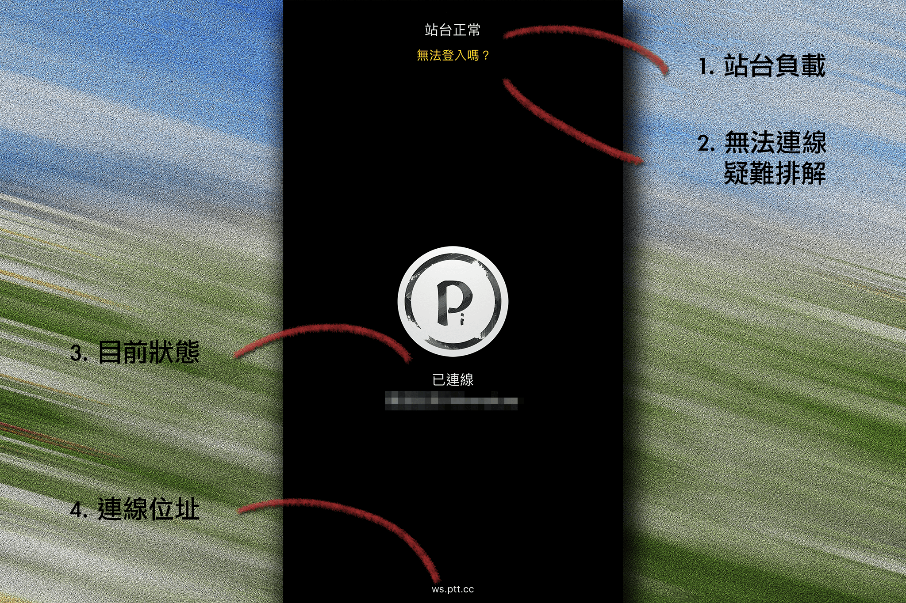

1. ### 站台負載
顯示目前站台負載情形  

  * 檢測 - 取得狀態中
  * 順暢 - 可快速登入
  * 正常 - 可正常登入
  * 緩慢 - 稍難登入
  * 衰弱 - 較難登入，常出現連線超時或無法連線
  * 掛了 - 無法登入，站台出現問題  
  
2. ### 無法連線疑難排解
點擊後開啟疑難排解步驟，可簡單排除無法連線的問題

3. ### 目前狀態
顯示目前連線狀態

4. ### 連線位址
預設為 SSH 連線，可為 ptt.cc 或以 ip 顯示（供中國使用者連線用，可在設定內調整，ptt.cc 無法在中國連線），WebSocket 連線為 ws.ptt.cc，目前為實驗性質。  
**由於 SSH 連線使用人數較多，在熱門時段會因為 PTT 站台連線數限制導致常常出現連線超時或失敗等問題，因此雖然 WebSocket 尚在實驗階段，但還是建議使用此連線方式以便快速登入。**  
  
[返回頁首](#操作手冊) 

## 主畫面

共有十種分頁，分別為最愛看板、熱門看板、分類看板、鄉民信箱、最新消息、延燒話題、關注話題、閱讀紀錄、最近造訪、鄉民名冊  
可在主選單 - 設定 - 設定分頁顯示與順序內調整首頁、排序與分頁開關。

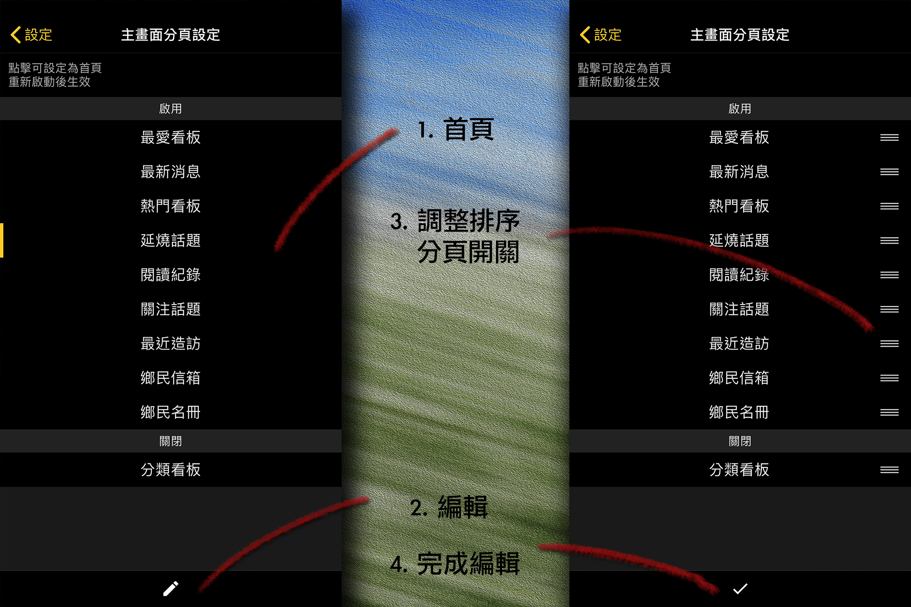

1. ### 首頁
點擊項目可設定為首頁，項目左方將有突顯標記，登入後將首先顯示此分頁

2. ### 編輯
點擊後可開始編輯排序與分頁開關

3. ### 調整排序、分頁開關
可拖曳各項目調整顯示排序，或放置於「關閉」區塊，此區塊內的分頁將不會顯示，至少需啟用三個以上的分頁。  

4. ### 完成編輯
點擊後完成分頁編輯，將在下次啟動 app 時生效。  
  
[返回頁首](#操作手冊) 

## 工具列

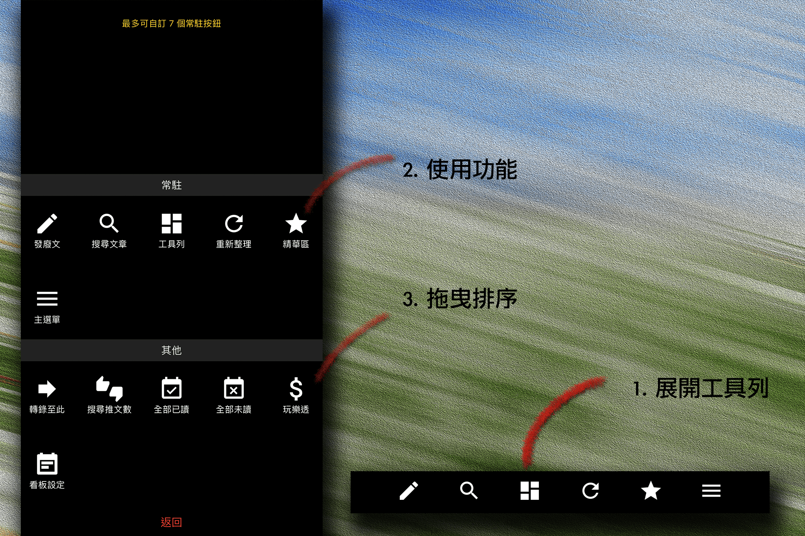

1. ### 展開工具列
點擊後可展開工具列，可進行排序與其他操作

2. ### 使用功能
點擊按鈕可直接使用該功能

3. ### 拖曳排序
長按按鈕可啟動排序，放置於常駐區塊將依照排序顯示於工具列，上限為七個按鈕，放置於其他區塊則不會顯示於工具列  
  
[返回頁首](#操作手冊) 

## 看板列表

看板列表包含最愛看板、熱門看板及子目錄

1. ### 看板項目
點擊進入看板、目錄，長按顯示看板選項，此處選項會依據分頁類型（如：最愛看板、熱門看板）或看板類型（目錄、是否加入最愛等等）而有所不同，前方的圓圈分別為藍色代表有新進文章未讀，灰色代表沒有新進文章未讀。

2. ### 看板類型
顯示看板類型，可為目錄或連結以及此看板是否加入最愛，最愛看板根目錄所有看板皆已加入最愛，因此一律不顯示最愛圖示，但子目錄則會顯示此圖示

3. ### 看板名稱
可以此名稱搜尋看板

4. ### 看板分類
此看板所屬分類

5. ### 看板描述
又稱板標，由板主修改。

6. ### 看板人氣
原始 PTT 站台人氣超過一千人後僅以「爆!」字加上顏色顯示，為協助新警察了解人氣代表意義，轉為數字顯示，數字顏色為原始 PTT 站台設定的人氣顏色  
原始站台顯示方式如以下所示：  

  * 白色 - 九十九人以下看板，並直接顯示人氣  
  * 亮白色 - 一百人以上看板，並顯示為 HOT  
  * 亮白色 - 一千人以上看板，並顯示為 爆!（以下顯示文字皆相同）  
  * 亮紅色 - 兩千人以上看板  
  * 亮藍色 - 五千人以上看板  
  * 亮青色 - 一萬人以上看板
  * 亮綠色 - 三萬人以上看板
  * 亮黃色 - 六萬人以上看板
  * 亮紫色 - 十萬人以上看板  

7. ### 看板序號
此看板在此頁面的序號，經由排序可改變，也可在特定排序功能內輸入序號調整排序

8. ### 搜尋看板
點擊後可搜尋看板，可使用看板名稱或關鍵字（板標）搜尋

9. ### 重新整理
點擊後重新整理看板列表

10. ### 寄信
點擊後進入信件編輯頁面

11. ### 主選單
點擊後開啟主選單  
  
[返回頁首](#操作手冊) 

## 看板選項

長按看板項目後顯示的看板操作項目

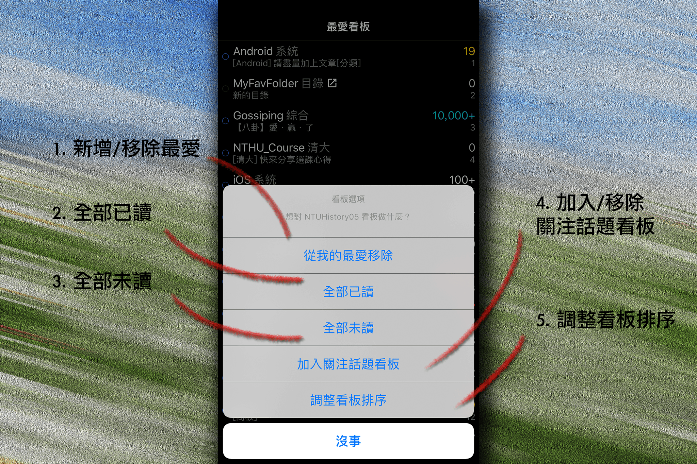

1. ### 新增/移除最愛
將看板加入/移除最愛看板，已加入最愛僅顯示移除選項，反之亦然  
若在子目錄顯示的情況下加入/移除最愛，則僅會異動此目錄內的看板

2. ### 全部已讀
將看板內所有文章設為已讀

3. ### 全部未讀
將看板內所有文章設為未讀

4. ### 加入/移除關注話題看板
關注後的看板文章將顯示於關注話題分頁，已加入關注話題將僅顯示移除選項，反之亦然

5. ### 調整看板排序
點擊後將顯示排序選項，有自訂排序、依照看板名稱排序以及依照看板分類排序三種方式  
  
[返回頁首](#操作手冊) 

## 最愛看板排序

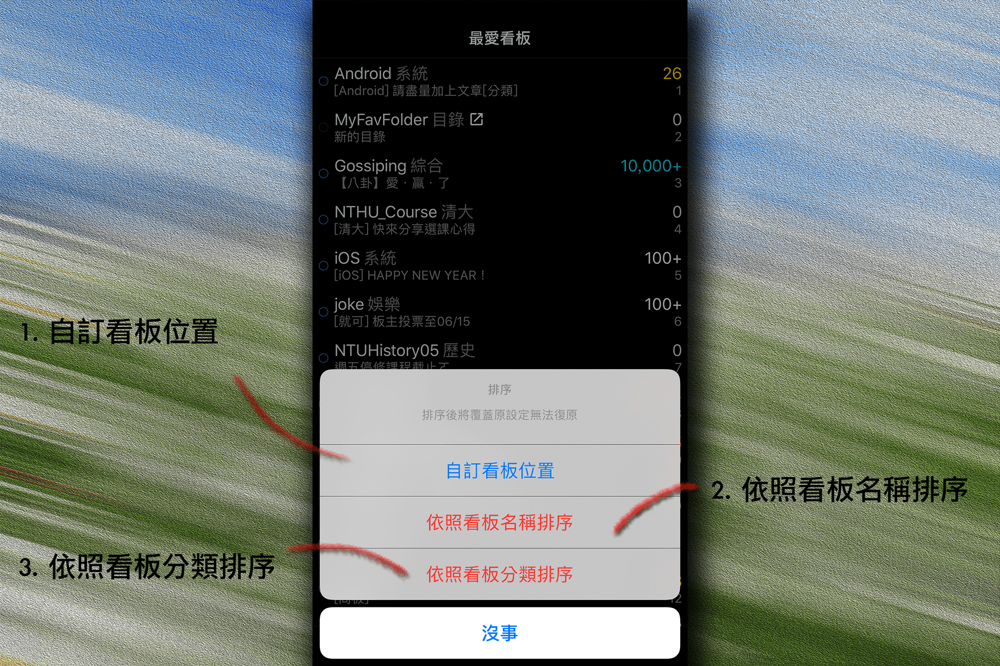  

1. ### 自訂看板位置
點擊後將可自訂任意看板位置，以拖曳方式操作，設定後無法復原。

2. ### 依照看板名稱排序
設定後無法復原

3. ### 依照看板分類排序
設定後無法復原

4. ### 拖曳看板
長按此按鈕啟動拖曳功能，可將看板位置移動至任意位置，右方序號將維持至儲存設定，以便恢復原位。

5. ### 完成排序
點擊後儲存排序結果。  
  
[返回頁首](#操作手冊) 

## 信件列表

  

1. ### 信件項目
點擊閱讀信件，長按顯示信件選項，前方的圖示為藍色代表未讀、灰色代表已讀、回覆圖示代表已回信。

2. ### 信件標題
寄件備份的標題前方將保留回信對象ID

3. ### 信件日期/作者
若此處為系統信件將無法回信，若為轉寄信件則顯示轉寄者的ID，而非轉寄內容作者的ID。
因此轉寄信件直接回信為回信給轉寄者，若需回信給內容作者可使用內容介面的「寫信給作者」。

4. ### 信件序號/狀態
此處將顯示信件為已讀、未讀、M標記、已回信等狀態，信件項目前方的圓圈及已回覆圖示皆以此為基準顯示。  
  
[返回頁首](#操作手冊) 

## 信件選項

  

1. ### 查詢作者資訊
點擊後將顯示作者資訊頁面。

2. ### 刪除信件
點擊後將刪除信件，確認視窗確定刪除後無法還原。

3. ### 轉寄信件
點擊後將顯示轉寄頁面，可將信件轉寄給其他鄉民或外部信箱。

4. ### M起來/取消M
點擊後將信件標記，標記的信件可避免意外被刪除，再使用一次此功能取消標記。

5. ### 封鎖
將寄件者加入封鎖名單，所有文章、信件、推文、水球以及話題皆會被封鎖，被封鎖的項目會顯示為淡化項目  
此處之所以不完全隱藏項目，是為避免造成 App 有刻意隱藏特定資訊的疑慮  
所有封鎖項目皆可隨時查閱或解除封鎖

6. ### 好鄉民
將寄件者加入好鄉民名單，推文前方將顯示愛心圖示，同時加入封鎖及好鄉民表示為超級好友，除了不會顯示為封鎖狀態外，推文前方將顯示特殊圖示。

7. ### 檢舉信件
將違規信件通報給管理者，由於信件只能到 Violation 看板檢舉，點擊後將僅顯示提示。

8. ### 自爆
很恐怖，不要問

9. ### 召喚神龍
集齊七顆龍珠即可使用

10. ### 毫無意義的按鈕
按了就知道  
  
[返回頁首](#操作手冊) 

## 話題功能

  

PiTT 有三大話題功能，取向各有不同，囊括 PTT 最具有討論度的話題  

*最新消息 - 全站最新發佈文章，篩選出具有成為延燒話題潛力的話題
*延燒話題 - 全站熱門文章，篩選出最具有討論度的文章
*關注話題 - 僅顯示有興趣的看板話題，或是使用**聚焦**功能顯示單一看板的所有話題，可設定為最新消息模式（預設）或延燒話題模式而顯示不同話題。    
  
[返回頁首](#操作手冊) 

## 最新消息/延燒話題

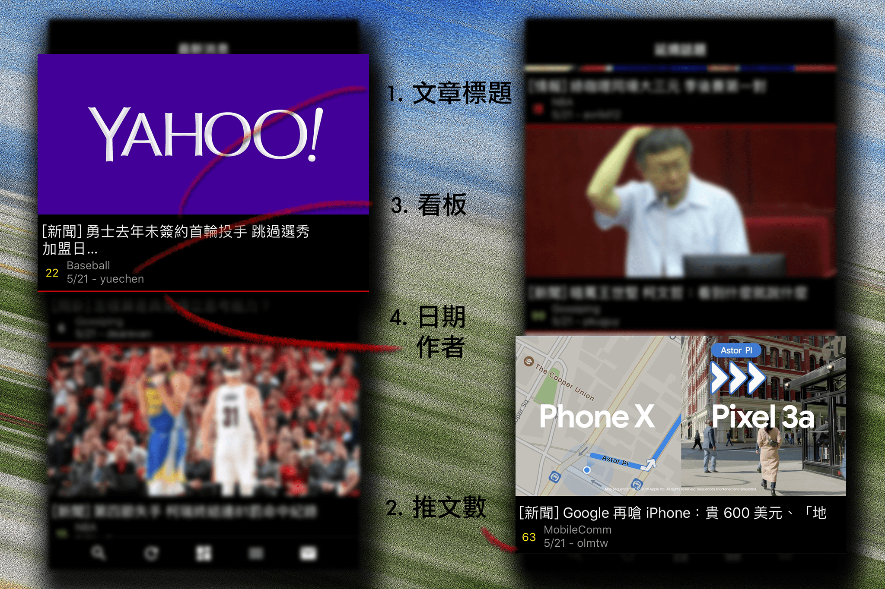

1. ### 文章標題
此文章的標題

2. ### 推文數
此文章的推文數，由於 PTT 在搜尋模式下的推文數顯示行為較特殊，不會顯示一般文章列表看到的推文數，因此有時會顯示為沒有推文是屬於正常狀態。

3. ### 看板
此文章所在看板

4. ### 日期/作者
此文章發佈的日期與作者  
  
[返回頁首](#操作手冊) 

## 延燒話題選項

與最新消息共用相同選項

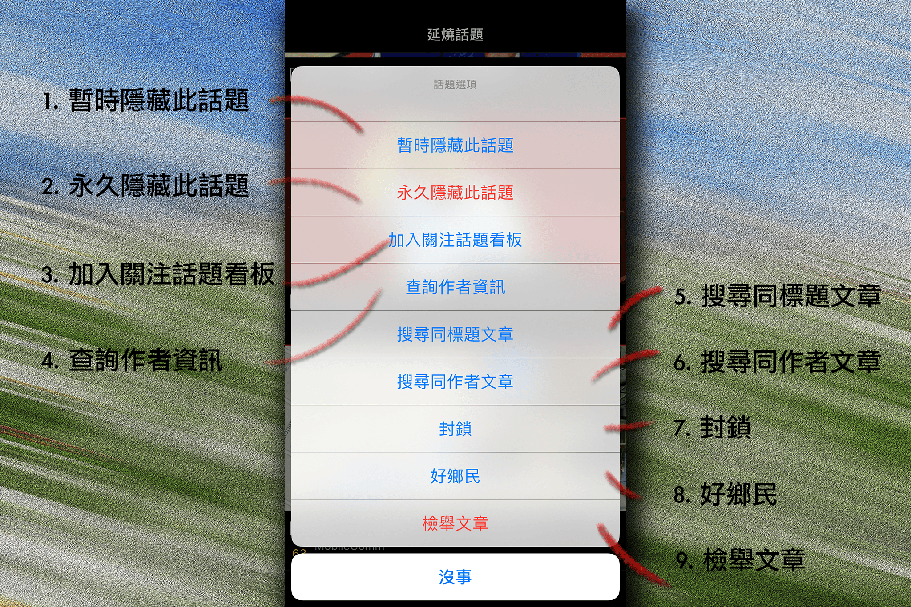 

1. ### 暫時隱藏此話題
點擊後將暫時隱藏話題，直到下次重新啟動 App 為止

2. ### 永久隱藏此話題
點擊後將永久隱藏此話題所在看板的所有文章，也可以在展開工具列後使用設定功能進入封鎖看板頁面編輯

3. ### 加入關注話題看板
點擊後會將此看板加入關注話題，若已加入則會顯示為移除選項

4. ### 查詢作者資訊
點擊後將顯示作者資訊頁

5. ### 搜尋同標題文章
點擊後將以此文章標題搜尋文章，PTT 站台的搜尋為「包含」方式，因此若出現類似標題也屬於正常結果

6. ### 搜尋同作者文章
點擊後將以此作者搜尋文章，PTT 站台的搜尋為「包含」方式，因此若出現其他作者文章也屬於正常結果

7. ### 封鎖
將作者加入封鎖名單，所有文章、信件、推文、水球以及話題皆會被封鎖，被封鎖的項目會顯示為淡化項目  
此處之所以不完全隱藏項目，是為避免造成 App 有刻意隱藏特定資訊的疑慮  
所有封鎖項目皆可隨時查閱或解除封鎖

8. ### 好鄉民
將作者加入好鄉民名單，推文前方將顯示愛心圖示，同時加入封鎖及好鄉民表示為超級好友，除了不會顯示為封鎖狀態外，推文前方將顯示特殊圖示。

9. ### 檢舉文章
將違規文章通報給板主，將會自動進入發信頁面並自動帶入檢舉表單與檢舉對象，若文章所在看板沒有板主將僅顯示至 Violation 看板檢舉提示。  
  
[返回頁首](#操作手冊) 

## 延燒話題設定

 

1. ### 設定
點擊後開啟話題設定選項

2. ### 切換排序
共有兩種排序方式，依話題熱門度排序以及依話題新鮮度排序

3. ### 編輯隱藏看板　
點擊後進入編輯隱藏看板頁面，可新增隱藏看板或刪除隱藏看板  
  
[返回頁首](#操作手冊) 

## 編輯隱藏看板

與最新消息共用設定

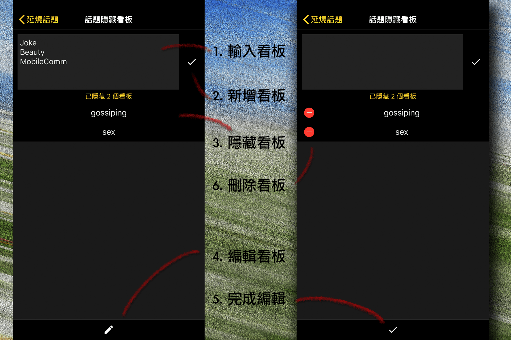 

1. ### 輸入看板
可一次輸入多個看板同時新增，以換行方式分隔各看板，不分大小寫

2. ### 新增看板
點擊後新增隱藏看板

3. ### 隱藏看板
隱藏看板列表

4. ### 編輯看板
點擊後開始編輯看板，可解除看板話題隱藏狀態

5. ### 完成編輯
點擊後完成編輯，離開此頁面後才會正式儲存編輯結果

6. ### 刪除看板
點擊後刪除此看板  
  
[返回頁首](#操作手冊) 

## 關注話題選項

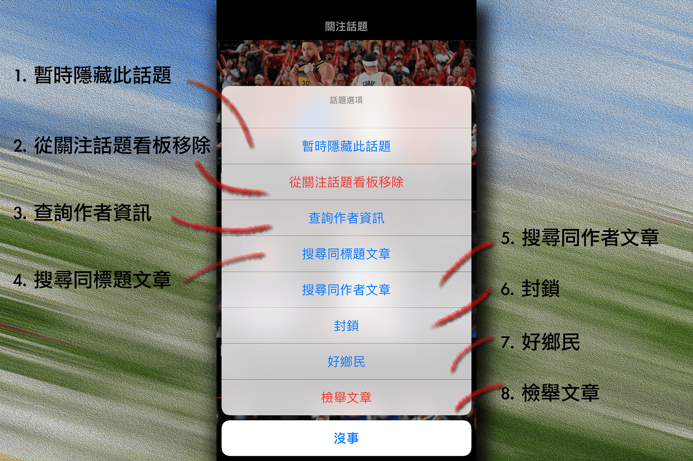 

1. ### 暫時隱藏此話題
點擊後將暫時隱藏話題，直到下次重新啟動 App 為止

2. ### 從關注話題看板移除
點擊後將此看板自關注話題看板移除，講不再顯示此看板文章

3. ### 查詢作者資訊
點擊後將顯示作者資訊頁

4. ### 搜尋同標題文章
點擊後將以此文章標題搜尋文章，PTT 站台的搜尋為「包含」方式，因此若出現類似標題也屬於正常結果

5. ### 搜尋同作者文章
點擊後將以此作者搜尋文章，PTT 站台的搜尋為「包含」方式，因此若出現其他作者文章也屬於正常結果

6. ### 封鎖
將作者加入封鎖名單，所有文章、信件、推文、水球以及話題皆會被封鎖，被封鎖的項目會顯示為淡化項目  
此處之所以不完全隱藏項目，是為避免造成 App 有刻意隱藏特定資訊的疑慮  
所有封鎖項目皆可隨時查閱或解除封鎖

7. ### 好鄉民
將作者加入好鄉民名單，推文前方將顯示愛心圖示，同時加入封鎖及好鄉民表示為超級好友，除了不會顯示為封鎖狀態外，推文前方將顯示特殊圖示。

8. ### 檢舉文章
將違規文章通報給板主，將會自動進入發信頁面並自動帶入檢舉表單與檢舉對象，若文章所在看板沒有板主將僅顯示至 Violation 看板檢舉提示。  
  
[返回頁首](#操作手冊) 

## 關注話題設定

 

1. ### 聚焦看板
點擊後將顯示目前已加入關注話題的所有看板，可隨意切換至任意看板瀏覽所有話題。

2. ### 設定
點擊後開啟關注話題設定選項

3. ### 切換排序
有預設模式（最新消息模式）與延燒話題模式兩種排序，話題篩選模式也各不相同。

4. ### 切換群組顯示
開啟後將以編輯隱藏看板頁面內的排序顯示看板話題，並在各看板依照第三點設定的排序顯示，關閉後則與延燒話題及最新消息相同，顯示話題的原始排序

5. ### 編輯關注看板　
點擊後進入編輯關注看板頁面，可新增或刪除看板，也可以在此調整看板顯示排序。  
  
[返回頁首](#操作手冊) 

## 編輯關注看板

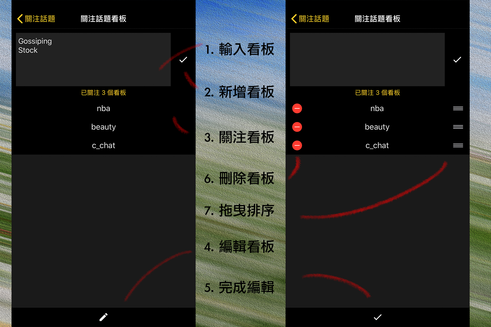 

1. ### 輸入看板
可一次輸入多個看板同時新增，以換行方式分隔各看板，不分大小寫

2. ### 新增看板
點擊後新增隱藏看板

3. ### 關注看板
關注看板列表

4. ### 編輯看板
點擊後開始編輯看板，可解除看板話題隱藏狀態

5. ### 完成編輯
點擊後完成編輯，離開此頁面後才會正式儲存編輯結果

6. ### 刪除看板
點擊後刪除此看板

7. ### 拖曳排序
若開啟群組設定，將會以此處的排序顯示看板話題，各看板內的話題再依照話題排序顯示  
  
[返回頁首](#操作手冊) 

## 閱讀紀錄

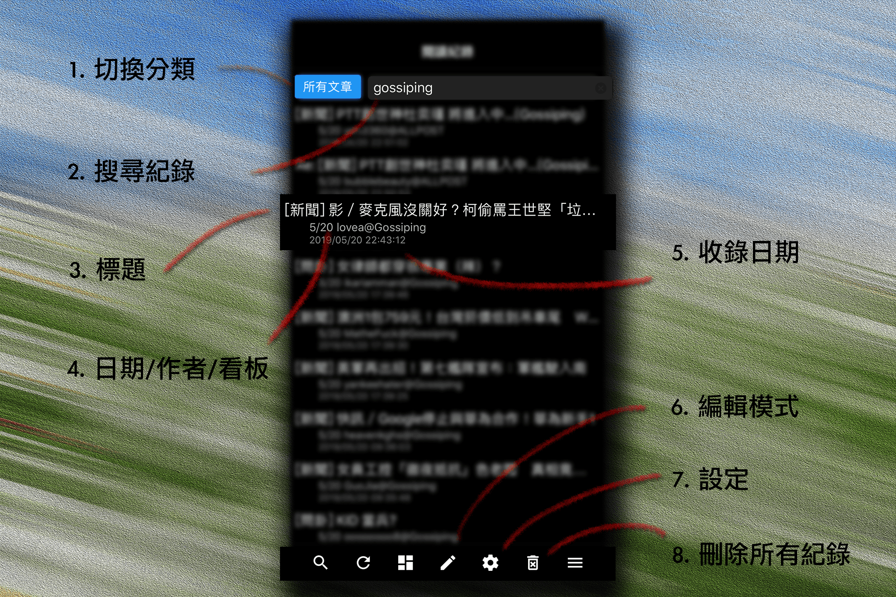 

1. ### 切換分類
點擊後顯示分類選單，共有五種分類  

*所有文章 - 目前登入帳號的所有閱讀紀錄，包含我的文章及已推文
*我的文章 - 目前登入帳號發文紀錄（需閱讀過才會紀錄）
*已推文 - 目前登入帳號推過文的文章記錄
*稍後閱讀 - 目前登入帳號加入稍後閱讀的文章
*追蹤文章 - 目前追蹤的文章

2. ### 搜尋紀錄
依據看板名稱、作者、標題等資訊搜尋紀錄

3. ### 標題
文章標題

4. ### 日期/作者/看板
文章發佈日期、作者及所在看板

5. ### 收錄日期
加入閱讀紀錄的日期

6. ### 編輯模式
開啟編輯模式，可刪除紀錄

7. ### 設定
開啟設定，可調整列表顯示方式

8. ### 刪除所有紀錄
可一次刪除所有紀錄  
  
[返回頁首](#操作手冊) 

## 閱讀紀錄分類

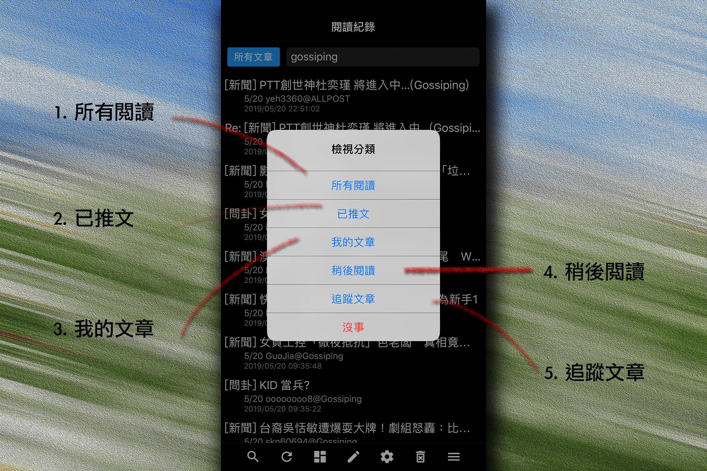   

1. ### 所有閱讀
目前登入帳號的所有閱讀紀錄，包含我的文章及已推文

2. ### 已推文
目前登入帳號推過文的文章記錄

3. ### 我的文章
目前登入帳號發文紀錄（需閱讀過才會紀錄）

4. ### 稍後閱讀
目前登入帳號加入稍後閱讀的文章

5. ### 追蹤文章
目前追蹤的文章  
  
[返回頁首](#操作手冊) 

## 閱讀紀錄顯示方式

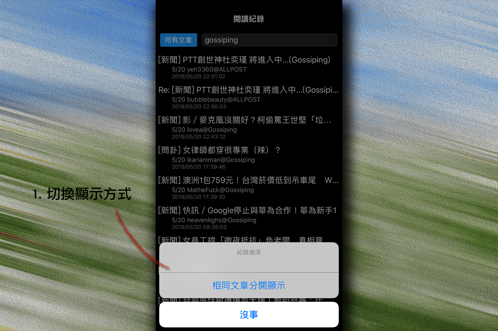   

1. ### 切換顯示方式
可將相同文章分開顯示為不同紀錄，或是合併為相同紀錄  
  
[返回頁首](#操作手冊) 

## 刪除閱讀紀錄

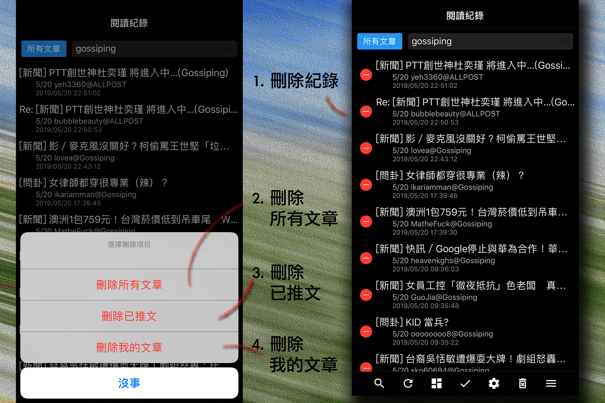   

1. ### 刪除紀錄
點擊後將刪除紀錄

2. ### 刪除所有文章
將刪除包含已推文、我的文章的所有閱讀紀錄，但不包含稍後閱讀及追蹤文章

3. ### 刪除已推文
刪除所有目前帳號推過文的閱讀紀錄

4. ### 刪除我的文章
刪除所有目前帳號發文的閱讀紀錄  
  
[返回頁首](#操作手冊) 

## 最近造訪

目前登入帳號的看板瀏覽紀錄

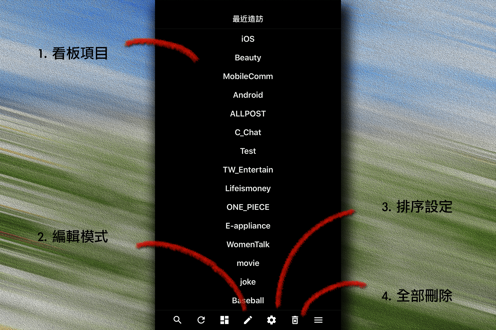  

1. ### 看板項目
點擊進入看板，長按顯示看板選項

2. ### 編輯模式
點擊開啟編輯模式，可刪除看板瀏覽紀錄

3. ### 排序設定
點擊後顯示排序選項

4. ### 全部刪除
點擊後可刪除所有看板瀏覽紀錄  
  
[返回頁首](#操作手冊) 

## 最近造訪選項

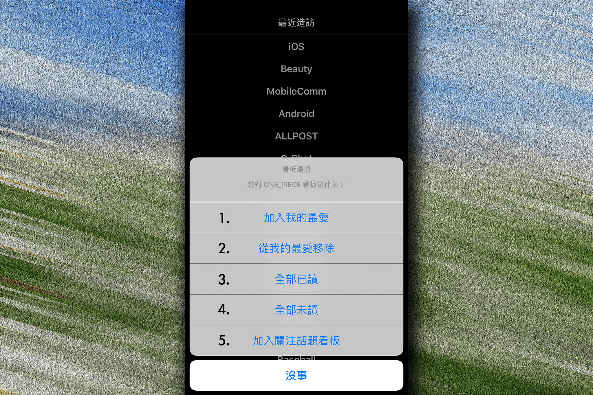  

1. ### 加入我的最愛
點擊後加入我的最愛當前目錄

2. ### 移除我的最愛
點擊後從我的最愛當前目錄移除

3. ### 全部已讀
將看板內所有文章設為已讀

4. ### 全部未讀
將看板內所有文章設為未讀

5. ### 加入/移除關注話題看板
點擊後加入/移除關注話題看板  
  
[返回頁首](#操作手冊) 

## 刪除最近造訪

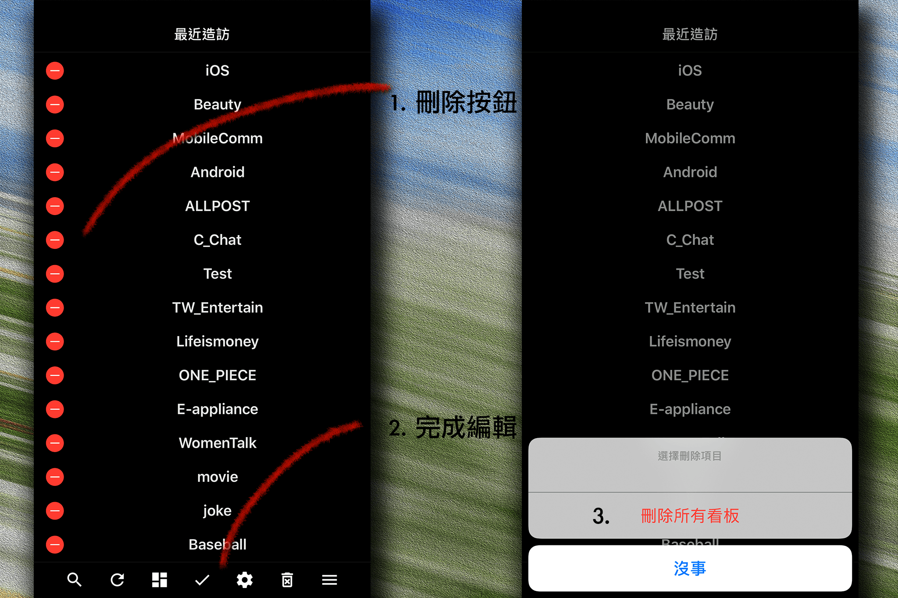  

1. ### 刪除按鈕
點擊後將該看板自瀏覽紀錄內移除

2. ### 完成編輯
點擊後儲存編輯結果

3. ### 刪除所有看板
點擊後刪除所有看板瀏覽紀錄  
  
[返回頁首](#操作手冊) 

## 最近造訪排序

  

共有三種排序  
  
* 依造訪次數排序
* 依造訪日期排序
* 依看板名稱排序  
  
[返回頁首](#操作手冊) 

## 分類看板

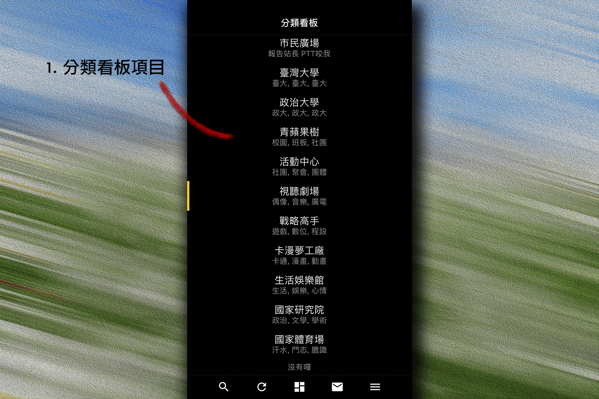  

1. ### 分類看板項目
點擊後進入分類

[返回頁首](#操作手冊) 

## 鄉民名冊

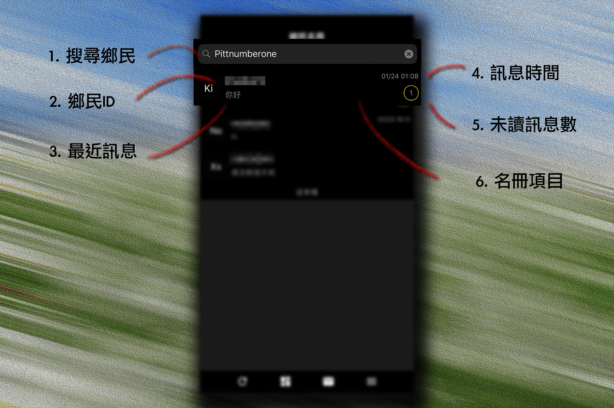   

1. ### 搜尋鄉民
輸入鄉民完整ID查詢鄉民資訊

2. ### 鄉民ID
加入名冊內的鄉民帳號

3. ### 最近訊息
水球聊天記錄內的最新訊息

4. ### 訊息時間
水球聊天記錄內的最新訊息時間

5. ### 未讀訊息數
尚未閱讀的訊息數量

6. ### 名冊項目
點擊可開啟水球聊天頁面，長按可顯示名冊選項  
  
[返回頁首](#操作手冊) 

## 名冊選項

 

1. ### 查詢鄉民資訊
點擊後將顯示鄉民資訊頁

2. ### 封鎖
將作者加入封鎖名單，所有文章、信件、推文、水球以及話題皆會被封鎖，被封鎖的項目會顯示為淡化項目  
此處之所以不完全隱藏項目，是為避免造成 App 有刻意隱藏特定資訊的疑慮  
所有封鎖項目皆可隨時查閱或解除封鎖

3. ### 好鄉民
將作者加入好鄉民名單，推文前方將顯示愛心圖示，同時加入封鎖及好鄉民表示為超級好友，除了不會顯示為封鎖狀態外，推文前方將顯示特殊圖示。

4. ### 刪除
將鄉民從名冊內刪除，一併刪除水球紀錄  
  
[返回頁首](#操作手冊) 

## 水球聊天

水球聊天為 PTT 內建聊天功能，由於架構較老舊，對於傳送訊息方面有些許限制

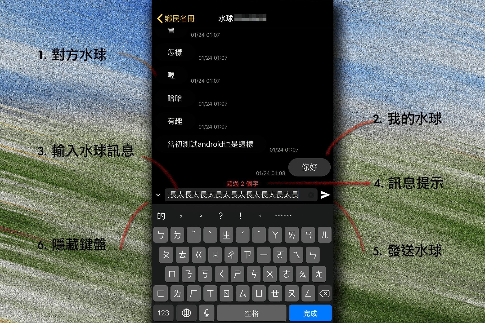   

1. ### 對方水球
對方傳送的水球訊息與時間

2. ### 我的水球
我傳送的水球訊息與時間

3. ### 輸入水球訊息
可輸入水球訊息

4. ### 訊息提示
水球訊息長度最大為 54 （中文長度為 2），超過此長度將無法傳送並顯示超過多少字元

5. ### 發送水球
點擊後送出水球，若對方已下線則無法傳送

6. ### 隱藏鍵盤
點擊後隱藏鍵盤  
  
[返回頁首](#操作手冊) 

## 文章列表

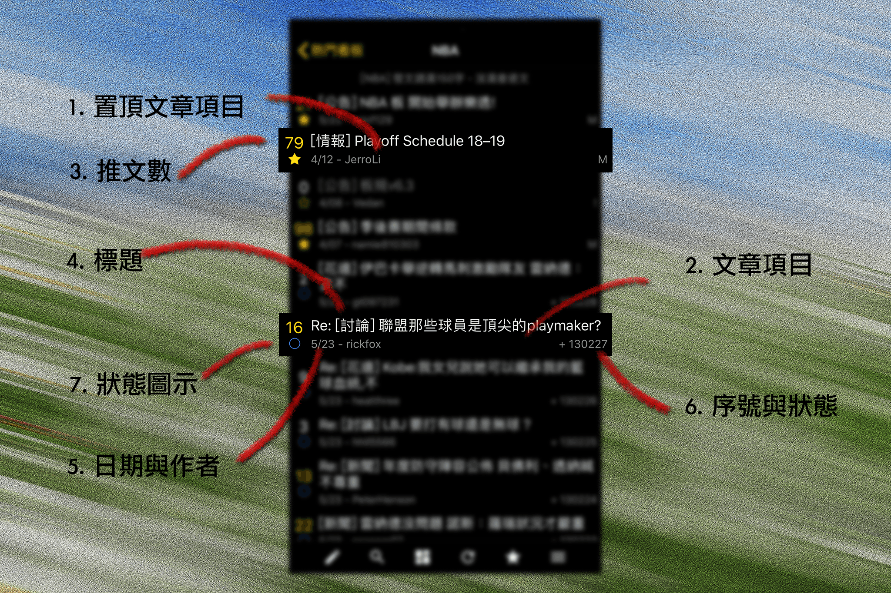   

1. ### 置頂文章項目
看板內的置頂（置底）文，點擊進入文章，長按顯示文章選項

2. ### 文章項目
看板內的文章，點擊進入文章，長按顯示文章選項

3. ### 推文數
文章的推文數，推文數較多則顯示為 1~99，超過將顯示為「爆」  
噓文數較多則顯示為X1~X9，每十則噓文進位一次，超過 99 則需文將顯示為「XX」 
計算方式為總推文數 - 總噓文數，正數顯示為推文數，負數顯示為噓文數

4. ### 標題
文章標題，有長度限制，多餘的部分將被刪減，進入內文後才會顯示完整標題 
前方的 [] 文字為文章分類，分類前方的文字則代表文章類型  
Re: 代表回文，Fw: 代表轉錄，Lk: 代表鎖文

5. ### 日期與作者
發文日期與作者

6. ### 序號與狀態
文章序號與文章狀態，其中序號非固定值，可能會因為刪文、搜尋結果改變而變動  
文章狀態有以下幾種：  
  
* "+" 未讀
* "~" 已讀但有新推文/經過編輯
* " " 已讀
* "M" 未讀且被板主標記，被標記的文章不會被系統清除
* "=" 已讀但有新推文/經過編輯且被板主標記
* "m" 已讀且被板主標記
* "!" 鎖文
* "S" 未讀且被板主標記
* "s" 已讀且被板主標記
* "D" 使用者標記
* "*" 已收錄到文摘，僅板主可見  

7. ### 狀態圖示
根據文章狀態顯示的圖示，  
置頂（置底）文以星號顯示，實心為未讀文章，空心為已讀文章，綠色空心為已讀但有新推文/經過編輯  
一般文章以圓圈顯示，藍色為未讀文章，灰色為已讀文章，綠色為已讀但有新推文/經過編輯  
  
[返回頁首](#操作手冊) 

## 文章列表功能

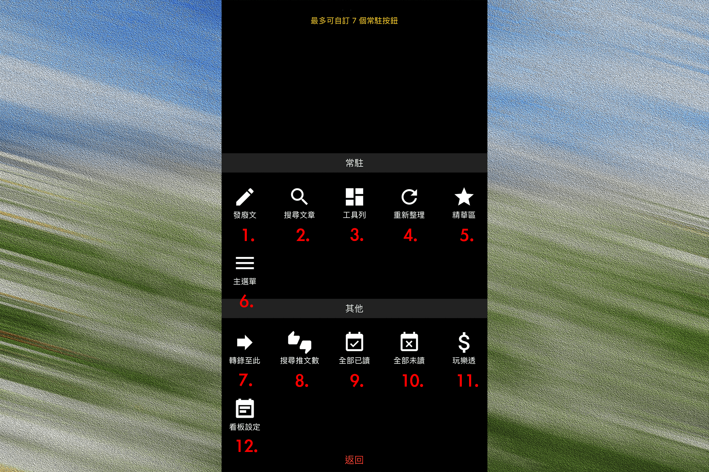   

1. ### 發廢文
發表文章功能，請先閱讀置底板規，以免被水桶

2. ### 搜尋文章　
可搜尋文章標題、作者與推文數 
比對方式皆為「包含」，因此搜尋作者時不會只有該作者的文章

3. ### 展開工具列
點擊後可展開工具列，可進行排序與其他操作

4. ### 重新整理
點擊後重新整理文章列表

5. ### 精華區
點擊後進入精華區

6. ### 主選單
點擊後進入主選單

7. ### 轉錄至此
須先到文章內使用「轉錄文章」功能，再到欲轉錄看板內使用此功能，即可將該篇文章轉錄至此

8. ### 搜尋推文數
快速鍵，點擊後開啟搜尋文章頁面並自動移動至搜尋推文數分頁

9. ### 全部已讀
將此看板所有文章設為已讀

10. ### 全部未讀
將此看板所有文章設為未讀

11. ### 玩樂透
點擊後開啟樂透頁面

12. ### 看板設定　
點擊後開啟看板設定檢視頁面，可查看此看板相關設定以及是否有發文權限  
  
[返回頁首](#操作手冊) 

## 文章列表選項

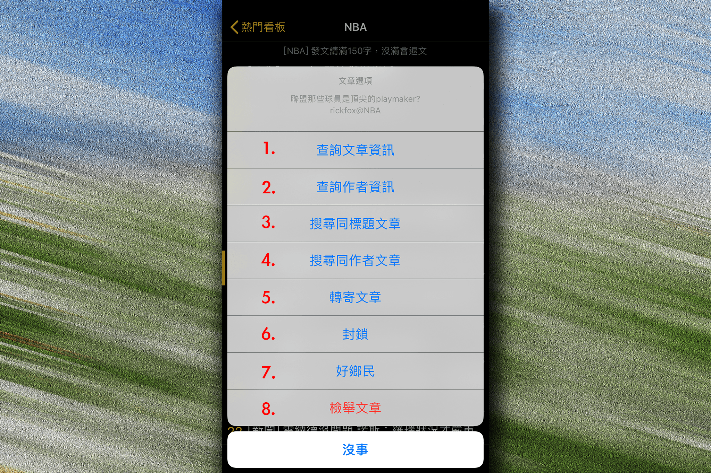 
  
1. ### 查詢文章資訊
點擊後顯示文章資訊頁面

2. ### 查詢作者資訊
點擊後顯示作者資訊頁面

3. ### 搜尋同標題文章
點擊後將以此文章標題搜尋文章，PTT 站台的搜尋為「包含」方式，因此若出現類似標題也屬於正常結果

4. ### 搜尋同作者文章
點擊後將以此作者搜尋文章，PTT 站台的搜尋為「包含」方式，因此若出現其他作者文章也屬於正常結果

5. ### 轉寄文章　
點擊後將顯示轉寄頁面，可將文章轉寄給自己、其他鄉民或外部信箱。

6. ### 封鎖
將作者加入封鎖名單，所有文章、信件、推文、水球以及話題皆會被封鎖，被封鎖的項目會顯示為淡化項目  
此處之所以不完全隱藏項目，是為避免造成 App 有刻意隱藏特定資訊的疑慮  
所有封鎖項目皆可隨時查閱或解除封鎖

7. ### 好鄉民
將作者加入好鄉民名單，推文前方將顯示愛心圖示，同時加入封鎖及好鄉民表示為超級好友，除了不會顯示為封鎖狀態外，推文前方將顯示特殊圖示。

8. ### 檢舉文章
將違規文章通報給板主，將會自動進入發信頁面並自動帶入檢舉表單與檢舉對象，若文章所在看板沒有板主將僅顯示至 Violation 看板檢舉提示。  
  
[返回頁首](#操作手冊) 

## 搜尋文章分頁

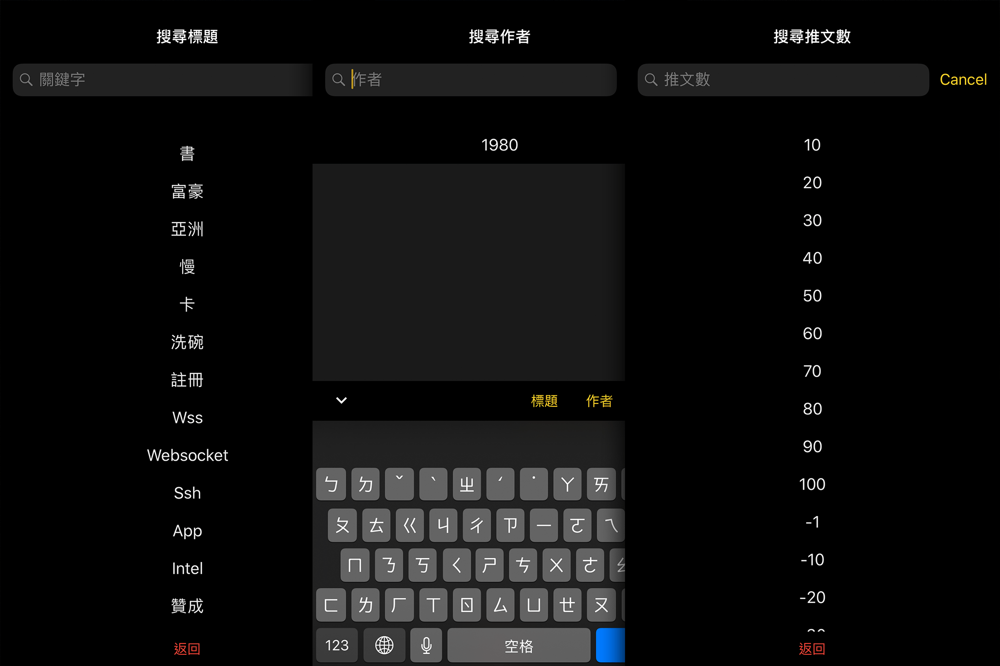 

共有三種分頁，四種搜尋功能，使用左右滑動切換頁面可操作搜尋紀錄，只有推文數列表為固定值供快速搜尋用  
  
* 搜尋標題  
* 搜尋作者
* 搜尋推文數
* 搜尋文章代碼（直接輸入#自動切換） 
  
[返回頁首](#操作手冊) 

## 搜尋文章

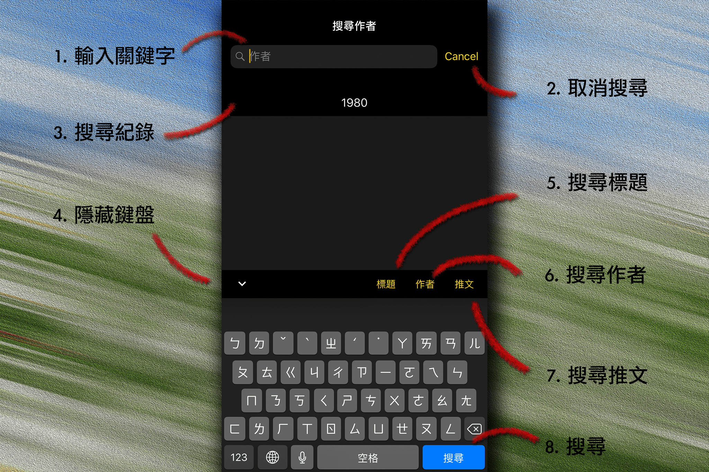 

1. ### 輸入關鍵字
可輸入標題關鍵字、作者ID或推文數搜尋

2. ### 取消搜尋
點擊後取消搜尋並離開此頁面

3. ### 搜尋紀錄
點擊可快速搜尋，長按可刪除搜尋紀錄，點擊後的搜尋類型為目前頁面類型

4. ### 隱藏鍵盤
點擊後隱藏鍵盤

5. ### 搜尋標題
點擊後以輸入的關鍵字搜尋標題，忽略目前頁面類型

6. ### 搜尋作者
點擊後以輸入的關鍵字搜尋作者，忽略目前頁面類型

7. ### 搜尋推文數
點擊後以輸入的推文數搜尋，忽略目前頁面類型

8. ### 搜尋
點擊後以輸入的關鍵字搜尋，搜尋類型為目前頁面類型  
  
[返回頁首](#操作手冊) 

## 搜尋文章代碼

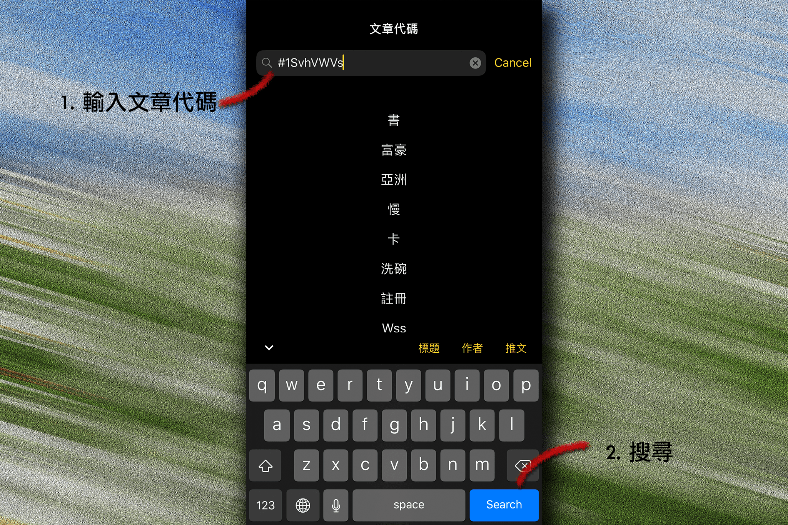 

1. ### 輸入文章代碼
在關鍵字輸入區輸入 # 後將自動轉換為搜尋文章代碼模式

2. ### 搜尋
點擊後以文章代碼進入文章  
  
[返回頁首](#操作手冊) 

## 刪除搜尋文章紀錄

 

1. ### 刪除關鍵字
刪除選擇的紀錄

2. ### 刪除所有紀錄
刪除目前搜尋類型的所有搜尋紀錄  
  
[返回頁首](#操作手冊) 

## 文章資訊

 

1. ### 文章標題
查詢的文章標題

2. ### 文章作者
查詢的文章發佈作者

3. ### 文章日期
查詢的文章發佈日期

4. ### 文章代碼
查詢的文章代碼，可使用此代碼快速進入文章

5. ### 文章連結
查詢的文章 Web 版連結

6. ### 文章價值
查詢的文章價值，只有 1P 幣以上才被計算為有效文章  
  
[返回頁首](#操作手冊) 

## 轉錄

轉錄前請詳閱注意事項並注意板規與站規

 

1. ### 轉錄目標看板
文章/信件將轉錄至此看板

2. ### 轉錄文章標題
欲轉錄的文章/信件標題

3. ### 轉錄來源作者
欲轉錄的文章作者/寄件者

4. ### 轉錄來源看板
欲轉錄的文章所在看板/信件序號

5. ### 取消轉錄
取消轉錄並離開頁面

6. ### 確定轉錄
將文章轉錄至此看板  
  
[返回頁首](#操作手冊) 

## 樂透

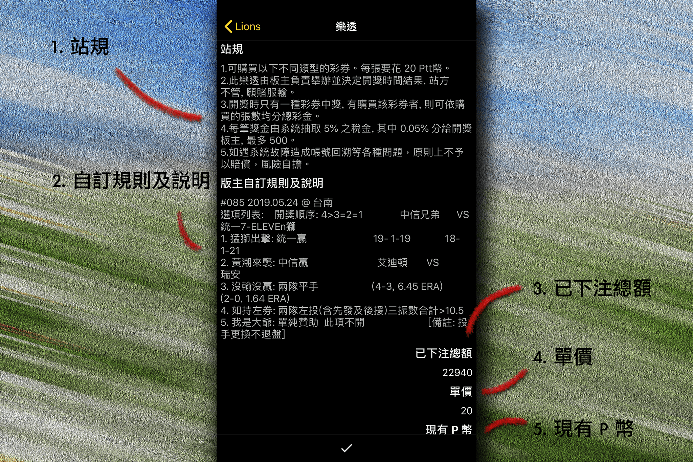  
 
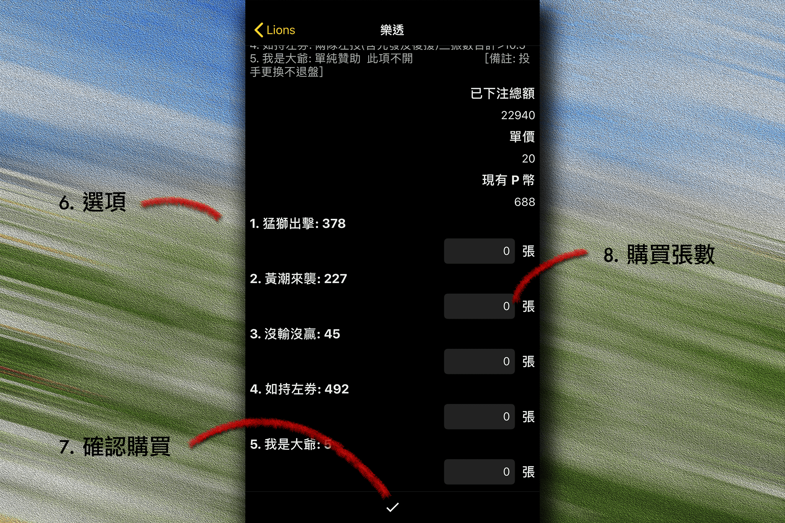   

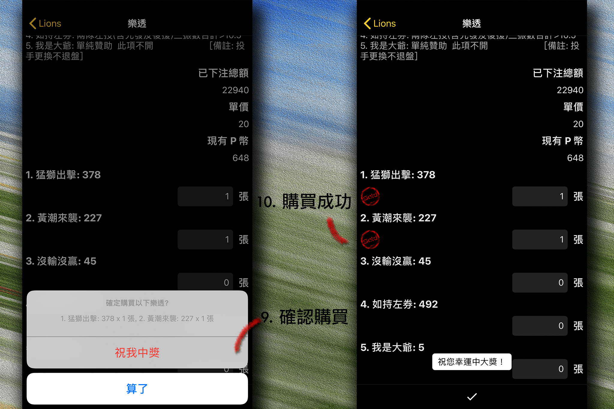   

1. ### 站規
樂透全站規則

2. ### 自訂規則及說明
樂透玩法

3. ### 已下注總額
目前樂透的下注總額

4. ### 單價
每一注樂透的單價

5. ### 現有批幣
目前擁有的 Ptt 幣

6. ### 選項
樂透項目名稱及下注總數

7. ### 確認購買
點擊後顯示確認下注選項

8. ### 購買張數
欲下注的數量

9. ### 再次確認購買
顯示總下注項目與數量，點擊後確定下注

10. ### 購買成功
購買成功項目將顯示已賣出圖示，若欲再次購買請離開後再次進入樂透頁面  
  
[返回頁首](#操作手冊) 

## 看板設定

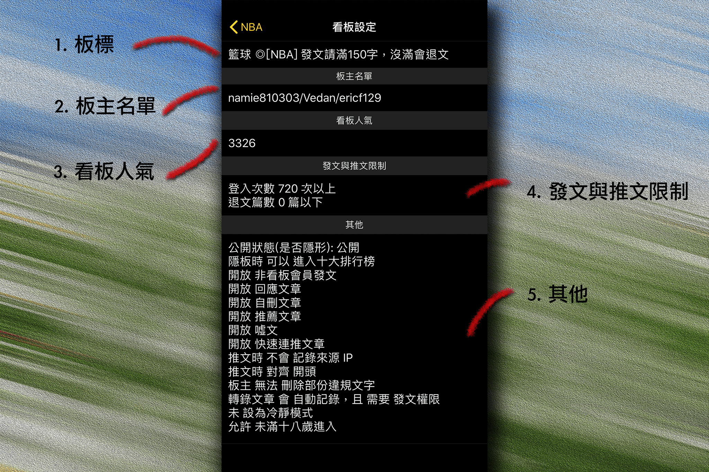   

1. ### 板標
看板描述

2. ### 板主名單
此看板的板主

3. ### 看板人氣
目前此看板的瀏覽人數

4. ### 發文與推文限制
若有不符合的項目將顯示為紅色文字，發文或推文前請確認是否符合此限制

5. ### 其他
此看板的其他設定  
  
[返回頁首](#操作手冊) 

## 轉寄

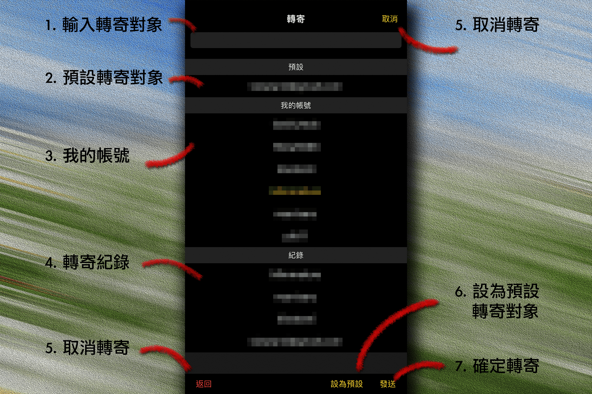   

1. ### 輸入轉寄對象
可輸入外部信箱位址或鄉民 ID

2. ### 預設轉寄對象
可設定一個目標

3. ### 我的帳號
PiTT 紀錄的帳號

4. ### 轉寄紀錄
長按可刪除紀錄

5. ### 取消轉寄
離開轉寄頁面

6. ### 設為預設轉寄對象
將目前輸入的外部信箱位址或鄉民 ID 設為預設轉寄對象

7. ### 確定轉寄
轉寄至信箱  
  
[返回頁首](#操作手冊) 

## 驗證碼

在某些情況下將顯示此頁面避免機器人自動操作造成站台負載過高(如：連續轉寄)

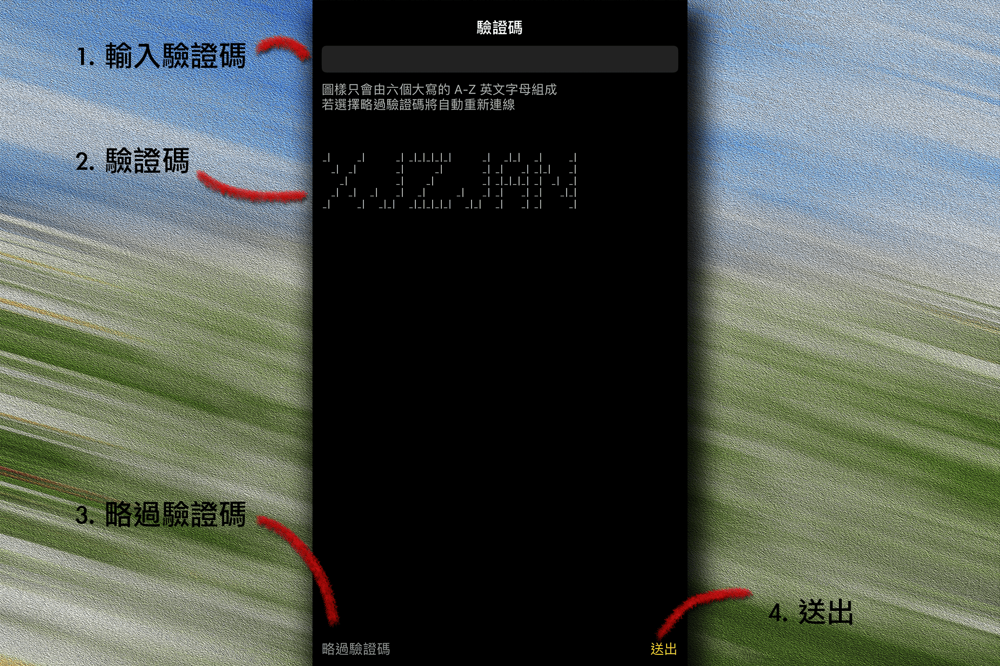   

1. ### 輸入驗證碼
輸入下方看見的驗證碼

2. ### 驗證碼
大寫英文字，共六碼

3. ### 略過驗證碼
點擊後將重新連線以繞過驗證碼，但若再次操作轉寄功能還是會再次出現，  
直到通過驗證為止

4. ### 送出
送出驗證  
  
[返回頁首](#操作手冊) 

## 使用者資訊

   

1. ### ID暱稱
查詢的使用者帳號與暱稱

2. ### 自訂別名
可輸入最多12個字元長度（中文長度為2）的自訂別名，將替代原帳號顯示於推文  
未來將支援至文章列表與話題列表

3. ### 經濟狀況
目前使用者的批幣多寡，只有本人可以看到實際數量

4. ### 登入次數
目前使用者的登入次數

5. ### 有效文章
目前使用者的有效文章數量，價值1P幣以上的文章才計入一篇

6. ### 目前動態
目前使用者的概略動態，如閱讀文章、文章列表等等，不會顯示實際動態

7. ### 私人信箱
目前使用者是否有信件未讀

8. ### 上次上站
目前使用者的上次上站時間

9. ### 上次故鄉
目前使用者的上次上站 IP 位址

10. ### 五子棋
目前使用者的五子棋戰績（目前僅電腦版可遊玩五子棋）

11. ### 象棋戰績
目前使用者的象棋戰績（目前僅電腦版可遊玩象棋）

12. ### 個人名片
目前使用者的個人名片  
  
[返回頁首](#操作手冊) 

----

## 簡介

PTT 為 BBS 站台，原始連線方式需使用個人電腦的終端機才能連線，  
後來出現了 PCMAN 等更加方便的電腦版客戶端，  
讓鄉民可以更便捷的瀏覽 PTT。  

PiTT 為第三方手機版瀏覽器，由於現今社會大眾傾向於使用手機上網，  
是為了讓鄉民能享用更加的使用者體驗以及更直覺的介面設計而開發的 App。  
  
[返回頁首](#問與答) 

## 連線方式

PTT 的連線方式有很多種

1. Telnet 
2. SSH
3. WebSocket

Telnet 是使用明碼傳輸，也就是有心人只要想就能知道你與伺服器間傳輸的所有資訊
速度最快，安全性最低，也是大多數 App 的預設連線方式

SSH 是使用加密傳輸，速度一般，安全性高，也是 PiTT 的預設連線方式

WebSocket 有加密傳輸與明碼傳輸，PiTT 使用的是加密傳輸，速度一般，安全性高  
  
[返回頁首](#問與答) 

## 無法登入

1. 重複登入帳號數量過多(3個)，若出現刪除重複登入提示請選擇刪除
2. 請到設定 - 連線 開啟僅使用 ptt.cc 位址連線(若有在中國使用請關閉) 
3. 網路環境無法使用 SSH 連線(port 22)，請確定使用的網路環境可以使用 SSH 連線
4. 被手機內安裝的系統管理應用程式阻擋，例如防火牆，背景服務限制管理，OperaMax ，擋廣告 App 等等(某些版本會導致頻繁斷線，可在 MobileComm 看板搜尋相關案例
)，Android 系統的限制背景連線也可能導致無法連線
5. PTT 伺服器維護中/過載
6. 重新開機重置裝置所有連線（台哥大、遠傳常使用到被 PTT 封鎖的 IP 位址導致無法連線）
7. 更換連線功能（SSH/WSS）
  
[返回頁首](#問與答) 

## 連線緩慢

#### 給懶得看的人的快速結論就是到設定內改為使用WebSocket連線
#### 測試最高紀錄為一秒內登入完成
#### 最主要的影響還是PTT伺服器本身

PTT 的連線方式有很多種

1. Telnet 
2. SSH
3. WebSocket

Telnet 是使用明碼傳輸，也就是有心人只要想就能知道你與伺服器間傳輸的所有資訊
速度最快，安全性最低，也是大多數 App 的預設連線方式

SSH 是使用加密傳輸，速度一般，安全性高，也是 PiTT 的預設連線方式

WebSocket 有加密傳輸與明碼傳輸，PiTT 使用的是加密傳輸，速度一般，安全性高

說了這麼多，為什麼會有人覺得 PiTT 登入慢，有人覺得 PiTT 登入快呢？

#### 重點來了

主要是因為在 SSH 連線方面 PTT 站台有限制登入處理的數量，  
在同一時間登入人數過多時就會需要等待，  
直到前面的人登入完畢  

舉例來說 當處理上限為一百人 而你是第一百零一個登入的人，  
你必須等待到第一個人登入成功後 PTT 才會開始處理你的登入動作，  
同時第一百零二個人順位就往前移動一個位子，  
這就是為什麼 PiTT 在某些時候不容易登入的原因，  
就是因為人太多而受限於站台本身的行為  

要解決這個問題只要到設定內修改為使用 WebSocket 連線即可  

那為什麼不設定為預設連線呢？  
因為站方目前還是把這項連線方式定位為實驗階段，  
如果設為預設連線而站方停止測試，  
那還不知道有連線方式可以調整的鄉民就會覺得 PiTT 壞掉了  

#### 關於重複登入

另外提供一個有關重複登入的資訊  

PTT 允許的重複登入連線只有三個，  
超過這個數量再選擇「允許重複登入」那個瞬間就會把你目前登入中的連線斷線，  
所以在連線失敗連續超過三次時 PiTT 就會強制跳出重複登入選項以供使用者選擇「不允許重複登入」，  
避免使用者卡在登入 - 被斷線的循環  

而在選擇不允許重複登入的時候常常有人覺得這裡卡很久，  
其實這也是 PTT 站台本身的限制，  
但我也不清楚 PTT 在處理哪些資訊，  
可能是重複登入帳號間的資訊同步作業讓這個動作花了些時間

以上就是關於登入的小知識  
  
[返回頁首](#問與答) 

## 樓層數消失

PTT 本身沒有支援樓層顯示，  
應用程式內的樓層數與推噓數都是由程式自行計算出來的，  
使用 End 之後是由文章最末頁開始讀取，  
因為無法讀取到第一樓所在位置，  
所以沒辦法計算樓層數為多少，  
推文後預設以 End 重新整理，  
因此同樣無法顯示樓層數，  
Home 則是重新整理後由文章第一頁開始讀取，  
所以可以依序計算樓層數與推噓數  
  
[返回頁首](#問與答) 

## 點擊文章與進入文章不符

如果是搜尋推文數狀態下點擊文章的確會出現這個問題喔，  
因為 PTT 的文章序號不是固定值，  
而推文數搜尋的異動情況也比較多，  
所以如果搜尋結果有異動就很可能造成點擊文章與進入文章不一致的情形，  
例如原本搜尋 50 推以上有 5 篇文章，  
但在手機上顯示結果後 PTT 伺服器多了 3 篇 50 推以上的文章，  
而這幾篇文章的時間又比較新的話就會改變其他文章的序號，  
這個算是手機版實作上的一個限制，  
不過只要重新整理後就可以恢復正常了  
  
[返回頁首](#問與答) 

## 回覆推文

PTT 本身沒有回覆推文功能，  
一般都是使用編輯文章功能自行在推文下方輸入回覆文字，  
編輯文章介面可以從文章內容介面展開按鈕後點擊「編輯文章」進入，  
長按推文後會顯示編輯介面，  
在推文日期後方輸入換行符號再輸入回覆文字即可，  
編輯完成後 PiTT 會顯示預覽並檢查是否有將推文改壞掉，  
不過編輯功能有點複雜，  
建議可以到 Test 看板熟悉編輯功能操作後再行使用，  
包括標記、刪除、回復上一個編輯版本等等  
  
[返回頁首](#問與答)  

## 發文或推文出現亂碼

發文、推文出現亂碼！！！  

最近偶爾會看到出現亂碼的文章或推文，  
然後底下就有鄉民推文開玩笑說：一定是用XXX發文的！  
之前也有一些使用者有回報出現亂碼的問題，  
乾脆在這裡再發一篇較完整的說明。  
  
其實，不管使用的是哪一款 PTT 瀏覽器，  
只要您輸入的文字是 PTT 系統本身不支援的字元，  
就會出現亂碼。  
也就是說，如果您輸入了某些"罕用字"就會造成亂碼的情形，  
即使您使用的是家喻戶曉的 PCMAN 也一樣，  
但 PCMAN 是即時顯示 PTT 回傳的內容，  
所以在輸入或貼上時就會立即出現亂碼或是根本無法輸入。  
  
最常出現此情形的是使用超注音的使用者，  
可能應用程式本身預設就有開啟罕用字的支援，  
而在自動選字時又會將罕用字排在第一順位(跟使用者自選詞也有關係，不能說全是超注音的問題)，  
所以常常出現此情形，  
最常見的例子，就是之前使用者回報的 "會" 與 "㑹" 兩個字，  
前者是 PTT 有支援的字元，後者是 PTT 不支援的字元，  
特別的是，PTT 是使用雙位元組呈現寬字元(也就是中文字)，  
而 PTT 看不懂的字元在輸出時就會將字元位元組隨意組合再輸出，  
因為正確的編碼被拆掉了，  
在頁面上原本 "㑹" 字本身以及其前後的文字就可能會呈現為亂碼，  
PCMAN 使用者可以在推文時試者貼上 "哈會哈" 與 "哈㑹哈" 看看差異，  
"㑹" 字後方搭配不同文字各有不同樂趣。  
以更簡單的例子來說，  
就是強迫一個不懂英文的人唸一段句子一樣，看不懂他就會亂念。  
  
基於以上原因，  
只要使用者從輸入法設定內將罕用字支援關閉就不太會出現此情形了，  
有些例外是當使用者從網頁直接複製貼上內容時也會出現亂碼，  
這個情形可能是複製的文字內容中也包含了某些不會顯示同時 PTT 也不支援的字元在內，  
這點就只能請使用者自行注意囉  
  
[返回頁首](#問與答) 

## 實名發布

實名發布為沿用PTT的名詞，  
這裡的「實名」是指是否要在發文時顯示ID，  
只有在匿名看板有作用，  
因為匿名看板有規定某些分類的文章必須顯示ID發文，  
此時就需要勾選實名發布，  
一般看板預設發文時就會顯示ID，  
所以有沒有勾選都沒有影響  

[返回頁首](#問與答) 

## 信件通知

#### 請開啟 App 通知權限

PTT 的信件通知與水球通知不一樣，  
只有在頁面切換時才會顯示在畫面上方，  
因此只有在操作 PTT 時才有辦法讀取通知，  
例如讀取文章、看板列表、文章列表等等，  
若在通知已顯示的情況下，  
必須要在讀取最新的信件內容後才會重設通知檢查狀態，  
其他 app 都是在背景固定一段時間自動連線至 PTT 檢查才有辦法主動通知，  
但此方法會佔用 PTT 過多資源，  
由於 PTT 沒有向開發者收費，  
所以會盡量避免加入這類背景自動讀取資料的功能，  
避免造成伺服器忙碌而影響到其他使用者登入使用的權利。  
  
PiTT 有另外加入「即時信件通知」功能，  
只要對方使用 PiTT 發信，  
有安裝 PiTT 的使用者就能即時收到信件通知  
  
[返回頁首](#問與答) 

## 無法開啟測試版本

iOS Beta (TestFlight)的每一個版本都只有90天的使用期限(自上傳送審日起算)，  
因此請盡量維持最新版本，  
另外若更換裝置或是使用 iCloud 復原裝置都可能導致 TestFlight 憑證錯誤，  
此時只要移除 TestFlight 與相關 app 後再重新安裝即可  

[返回頁首](#問與答) 

## 封鎖樣式

不完全隱藏黑名單是為了避免 App 刻意隱藏某些特定資訊的疑慮，   
若有顯示隱藏哪些項目，可以讓使用者更安心，   
另外一點則是方便使用者隨時解除隱藏狀態，   
除了永久解除封鎖，PiTT 還有暫時解除封鎖跟超級好友（同時加入封鎖與好鄉民），   
這些功能都需要保留封鎖項目才會更方便。   

若真的不想在推文看見某些帳號，   
可以查詢該位鄉民後編輯「別名」項目，   
即可替代帳號顯示。

[返回頁首](#問與答) 
