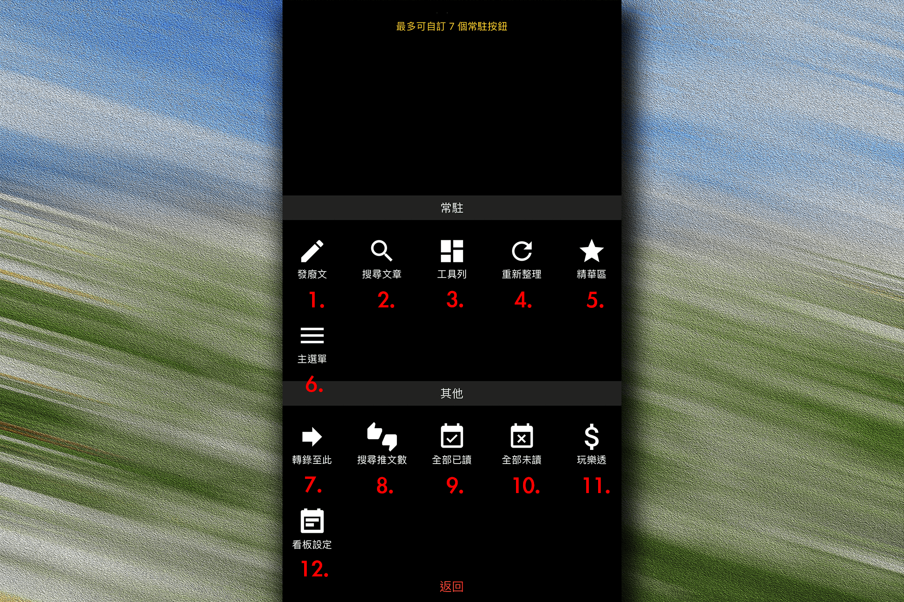

## 文章列表功能

   

1. ### 發廢文
發表文章功能，請先閱讀置底板規，以免被水桶

2. ### 搜尋文章
可搜尋文章標題、作者與推文數 
比對方式皆為「包含」，因此搜尋作者時不會只有該作者的文章

3. ### 展開工具列
點擊後可展開工具列，可進行排序與其他操作

4. ### 重新整理
點擊後重新整理文章列表

5. ### 精華區
點擊後進入精華區

6. ### 主選單
點擊後進入主選單

7. ### 轉錄至此
須先到文章內使用「轉錄文章」功能，再到欲轉錄看板內使用此功能，即可將該篇文章轉錄至此

8. ### 搜尋推文數
快速鍵，點擊後開啟搜尋文章頁面並自動移動至搜尋推文數分頁

9. ### 全部已讀
將此看板所有文章設為已讀

10. ### 全部未讀
將此看板所有文章設為未讀

11. ### 玩樂透
點擊後開啟樂透頁面

12. ### 看板設定
點擊後開啟看板設定檢視頁面，可查看此看板相關設定以及是否有發文權限  
  
[返回首頁](https://kimieno.github.io/ios.pitt) 