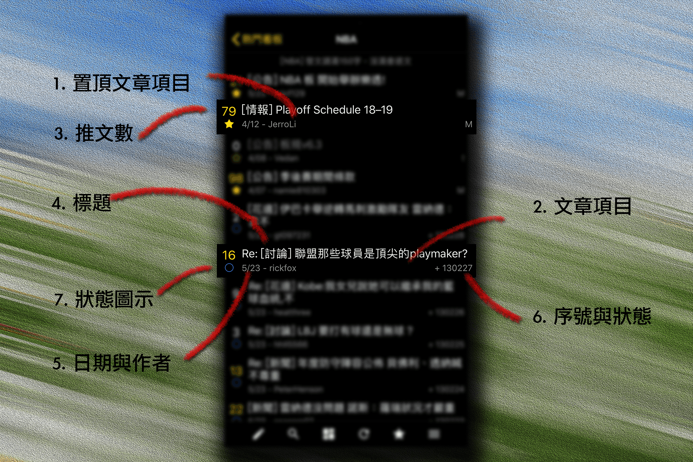

## 文章列表

   

1. ### 置頂文章項目
看板內的置頂（置底）文，點擊進入文章，長按顯示文章選項

2. ### 文章項目
看板內的文章，點擊進入文章，長按顯示文章選項

3. ### 推文數
文章的推文數，推文數較多則顯示為 1~99，超過將顯示為「爆」  
噓文數較多則顯示為X1~X9，每十則噓文進位一次，超過 99 則需文將顯示為「XX」 
計算方式為總推文數 - 總噓文數，正數顯示為推文數，負數顯示為噓文數

4. ### 標題
文章標題，有長度限制，多餘的部分將被刪減，進入內文後才會顯示完整標題 
前方的 [] 文字為文章分類，分類前方的文字則代表文章類型  
Re: 代表回文，Fw: 代表轉錄，Lk: 代表鎖文

5. ### 日期與作者
發文日期與作者

6. ### 序號與狀態
文章序號與文章狀態，其中序號非固定值，可能會因為刪文、搜尋結果改變而變動  
文章狀態有以下幾種：  
  
* "+" 未讀
* "~" 已讀但有新推文/經過編輯
* " " 已讀
* "M" 未讀且被板主標記，被標記的文章不會被系統清除
* "=" 已讀但有新推文/經過編輯且被板主標記
* "m" 已讀且被板主標記
* "!" 鎖文
* "S" 未讀且被板主標記
* "s" 已讀且被板主標記
* "D" 使用者標記
* "*" 已收錄到文摘，僅板主可見  

7. ### 狀態圖示
根據文章狀態顯示的圖示，  
置頂（置底）文以星號顯示，實心為未讀文章，空心為已讀文章，綠色空心為已讀但有新推文/經過編輯  
一般文章以圓圈顯示，藍色為未讀文章，灰色為已讀文章，綠色為已讀但有新推文/經過編輯  
  
[返回首頁](https://kimieno.github.io/ios.pitt) 