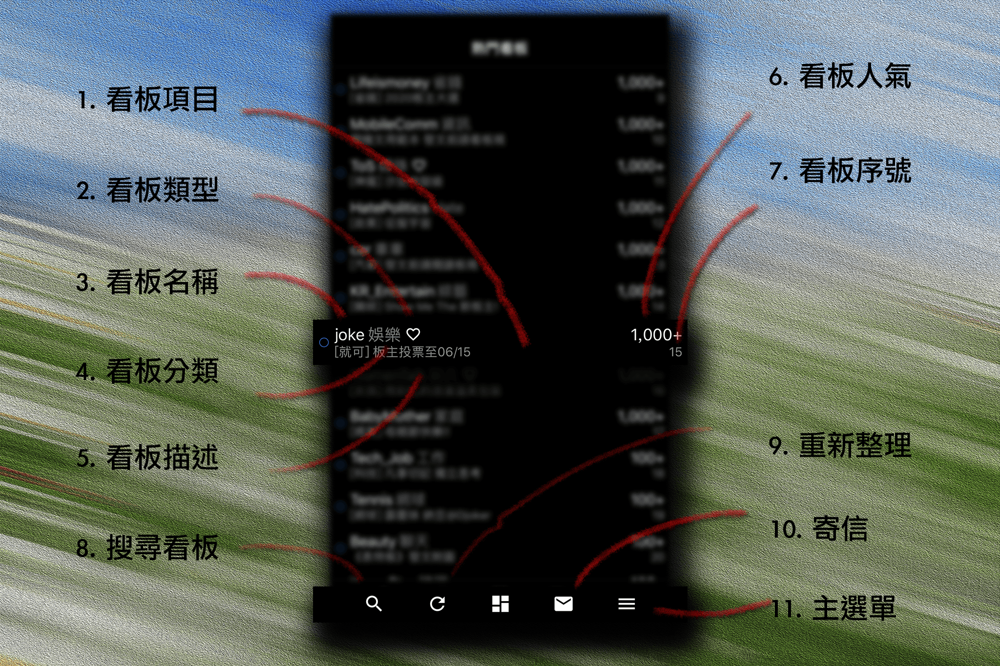

## 看板列表

看板列表包含最愛看板、熱門看板及子目錄

1. ### 看板項目
點擊進入看板、目錄，長按顯示看板選項，此處選項會依據分頁類型（如：最愛看板、熱門看板）或看板類型（目錄、是否加入最愛等等）而有所不同，前方的圓圈分別為藍色代表有新進文章未讀，灰色代表沒有新進文章未讀。

2. ### 看板類型
顯示看板類型，可為目錄或連結以及此看板是否加入最愛，最愛看板根目錄所有看板皆已加入最愛，因此一律不顯示最愛圖示，但子目錄則會顯示此圖示

3. ### 看板名稱
可以此名稱搜尋看板

4. ### 看板分類
此看板所屬分類

5. ### 看板描述
又稱板標，由板主修改。

6. ### 看板人氣
原始 PTT 站台人氣超過一千人後僅以「爆!」字加上顏色顯示，為協助新警察了解人氣代表意義，轉為數字顯示，數字顏色為原始 PTT 站台設定的人氣顏色  
原始站台顯示方式如以下所示：  

  * 白色 - 九十九人以下看板，並直接顯示人氣  
  * 亮白色 - 一百人以上看板，並顯示為 HOT  
  * 亮白色 - 一千人以上看板，並顯示為 爆!（以下顯示文字皆相同）  
  * 亮紅色 - 兩千人以上看板  
  * 亮藍色 - 五千人以上看板  
  * 亮青色 - 一萬人以上看板
  * 亮綠色 - 三萬人以上看板
  * 亮黃色 - 六萬人以上看板
  * 亮紫色 - 十萬人以上看板  

7. ### 看板序號
此看板在此頁面的序號，經由排序可改變，也可在特定排序功能內輸入序號調整排序

8. ### 搜尋看板
點擊後可搜尋看板，可使用看板名稱或關鍵字（板標）搜尋

9. ### 重新整理
點擊後重新整理看板列表

10. ### 寄信
點擊後進入信件編輯頁面

11. ### 主選單
點擊後開啟主選單  
  
[返回首頁](https://kimieno.github.io/ios.pitt) 