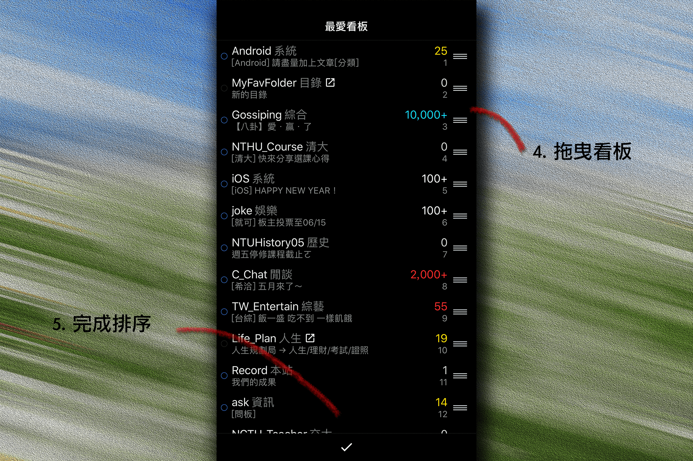

#####o
## 最愛看板排序

  

1. ### 自訂看板位置
點擊後將可自訂任意看板位置，以拖曳方式操作，設定後無法復原。

2. ### 依照看板名稱排序
設定後無法復原

3. ### 依照看板分類排序
設定後無法復原

4. ### 拖曳看板
長按此按鈕啟動拖曳功能，可將看板位置移動至任意位置，右方序號將維持至儲存設定，以便恢復原位。

5. ### 完成排序
點擊後儲存排序結果。  
  
[返回首頁](https://kimieno.github.io/ios.pitt) 