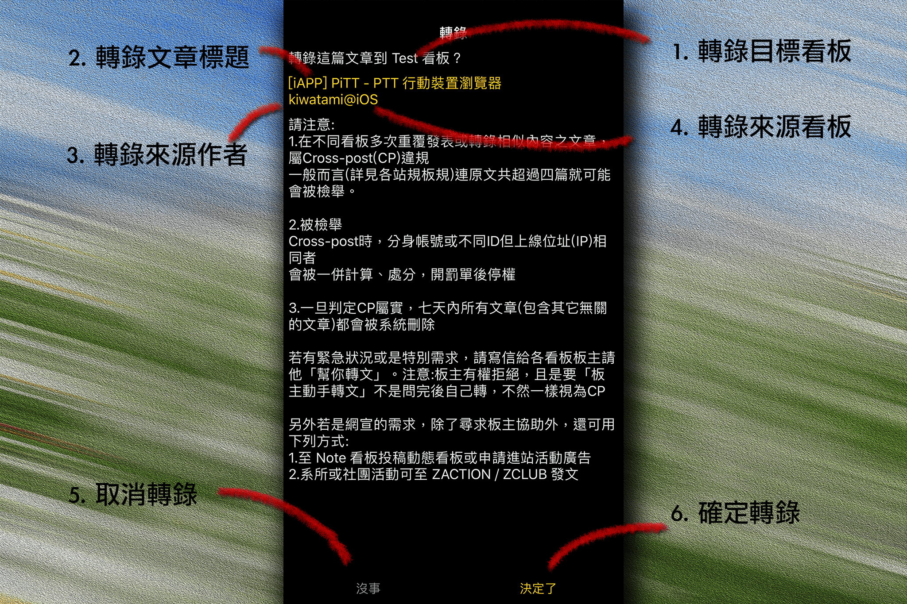

##### o
## 轉錄

轉錄前請詳閱注意事項並注意板規與站規

 

1. ### 轉錄目標看板
文章/信件將轉錄至此看板

2. ### 轉錄文章標題
欲轉錄的文章/信件標題

3. ### 轉錄來源作者
欲轉錄的文章作者/寄件者

4. ### 轉錄來源看板
欲轉錄的文章所在看板/信件序號

5. ### 取消轉錄
取消轉錄並離開頁面

6. ### 確定轉錄
將文章轉錄至此看板  
  
[返回首頁](https://kimieno.github.io/ios.pitt) 