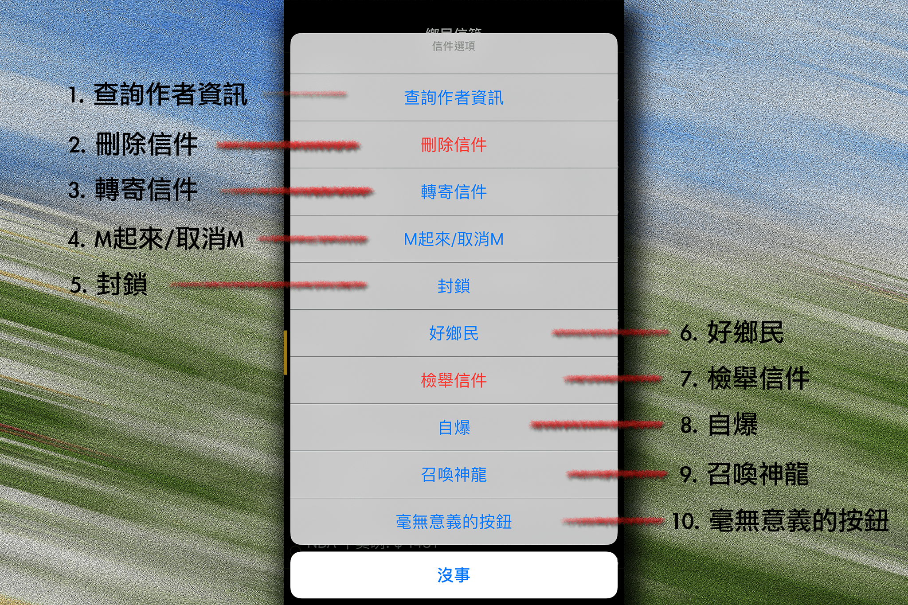

#####o
## 信件選項

  

1. ### 查詢作者資訊
點擊後將顯示作者資訊頁面。

2. ### 刪除信件
點擊後將刪除信件，確認視窗確定刪除後無法還原。

3. ### 轉寄信件
點擊後將顯示轉寄頁面，可將信件轉寄給其他鄉民或外部信箱。

4. ### M起來/取消M
點擊後將信件標記，標記的信件可避免意外被刪除，再使用一次此功能取消標記。

5. ### 封鎖
將寄件者加入封鎖名單，所有文章、信件、推文、水球以及話題皆會被封鎖，被封鎖的項目會顯示為淡化項目  
此處之所以不完全隱藏項目，是為避免造成 App 有刻意隱藏特定資訊的疑慮  
所有封鎖項目皆可隨時查閱或解除封鎖

6. ### 好鄉民
將寄件者加入好鄉民名單，推文前方將顯示愛心圖示，同時加入封鎖及好鄉民表示為超級好友，除了不會顯示為封鎖狀態外，推文前方將顯示特殊圖示。

7. ### 檢舉信件
將違規信件通報給管理者，由於信件只能到 Violation 看板檢舉，點擊後將僅顯示提示。

8. ### 自爆
很恐怖，不要問

9. ### 召喚神龍
集齊七顆龍珠即可使用

10. ### 毫無意義的按鈕
按了就知道  
  
[返回首頁](https://kimieno.github.io/ios.pitt) 