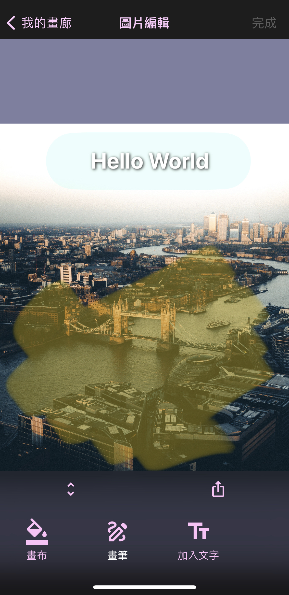
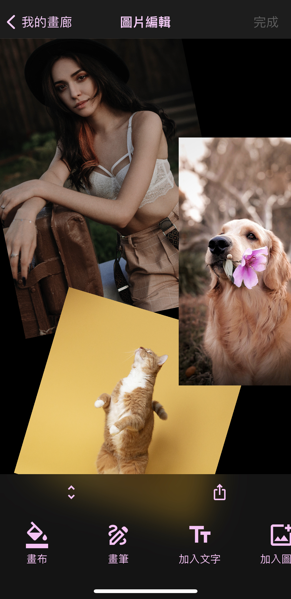

##### o
## 圖片編輯

### 1. 畫布
點擊設定背景顏色，長按回復透明背景。

### 2. 畫筆
點擊使用畫筆塗鴉。

### 3. 加入文字
點擊加入文字，可設定字型、字體、大小、顏色、背景色、背景圓角與內邊距以及陰影。  
加入畫布後可使用拖曳、縮放、旋轉或使用長按再次進行編輯。
若需刪除請直接刪除文字即可自動從畫布移除。

### 4. 加入圖片
點擊加入圖片，可在稍後進行移動、旋轉與縮放，
若要重新設定圖片請長按圖片後使用「位置」功能進行調整。

##### Photo by [Jose Llamas](https://unsplash.com/@josilito) on [Unsplash](https://unsplash.com/)
##### Photo by [Artem Ivanchencko](https://unsplash.com/@artemivanchencko) on [Unsplash](https://unsplash.com/)
##### Photo by [Celine Sayuri Tagami](https://unsplash.com/ko/@celine_sayuri) on [Unsplash](https://unsplash.com/)
##### Photo by [Kabo](https://unsplash.com/@kabofoods) on [Unsplash](https://unsplash.com/)

[返回首頁](https://kimieno.github.io/ios.pitt) 