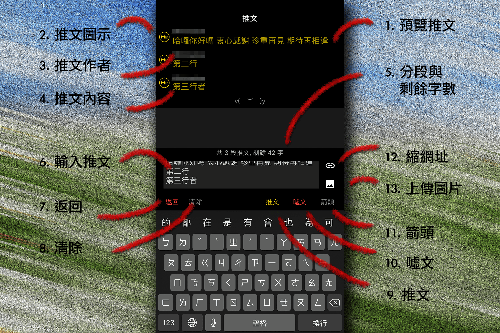

##### o
## 推文頁面

 

1. ### 預覽推文
此處將預覽推文送出結果，可方便地檢視分段後的推文是否流暢

2. ### 推文圖示
此處一律顯示我的推文圖示

3. ### 推文作者
此處一律顯示目前登入帳號

4. ### 推文內容
預覽推文內容

5. ### 分段與剩餘字數
顯示目前分為幾段推文，這一樓層的推文還剩幾個字會自動分段

6. ### 輸入推文
輸入要發送的推文，可以使用換行符號手動分段

7. ### 返回
取消推文，若尚有推文未送出將自動儲存草稿，關閉 App 後消失

8. ### 清除
清除已輸入的推文

9. ### 推文
以推文方式送出，此按鈕會根據目前是否能夠推文改變顯示狀態，  
一般來說，推文皆有冷卻時間，在一段時間內無法重複推文，  
此時推文按鈕便會隱藏

10. ### 噓文
以噓文方式送出，此按鈕會根據目前是否能夠噓文改變顯示狀態，  
一般來說，噓文皆有冷卻時間，在一段時間內無法重複噓文，  
此時噓文按鈕便會隱藏，  
另外，某些看板會將噓文功能關閉，  
此時噓文按鈕也會隱藏

11. ### 箭頭
以箭頭方式送出，此按鈕會根據目前是否能夠箭頭方式發送推文改變顯示狀態，  
一般來說，箭頭沒有冷卻時間，因此會一直顯示

12. ### 縮網址
進入縮網址功能頁面

13. ### 上傳圖片
上傳圖片後將顯示圖片網址  
  
[返回首頁](https://kimieno.github.io/ios.pitt) 