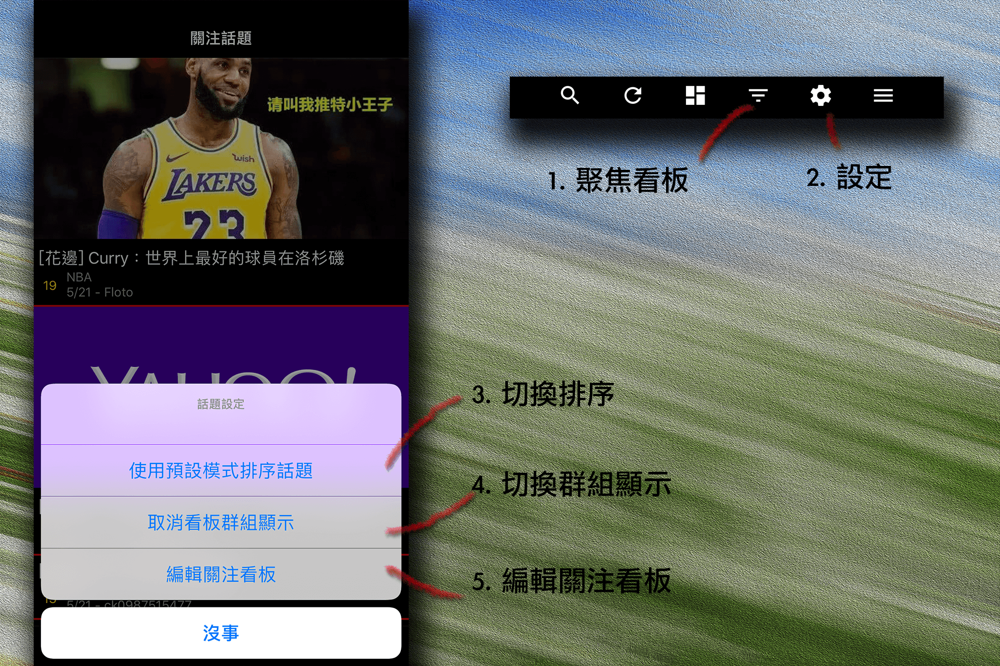

##### o
## 關注話題設定

 

1. ### 聚焦看板
點擊後將顯示目前已加入關注話題的所有看板，可隨意切換至任意看板瀏覽所有話題。

2. ### 設定
點擊後開啟關注話題設定選項

3. ### 切換排序
有預設模式（最新消息模式）與延燒話題模式兩種排序，話題篩選模式也各不相同。

4. ### 切換群組顯示
開啟後將以編輯隱藏看板頁面內的排序顯示看板話題，並在各看板依照第三點設定的排序顯示，關閉後則與延燒話題及最新消息相同，顯示話題的原始排序

5. ### 編輯關注看板
點擊後進入編輯關注看板頁面，可新增或刪除看板，也可以在此調整看板顯示排序。  
  
[返回首頁](https://kimieno.github.io/ios.pitt) 