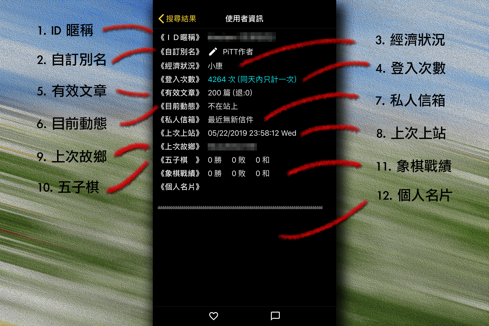

## 使用者資訊

追隨功能可在鄉民發文後收到通知，水球聊天介面也可以藉由點擊下方的聊天按鈕進入

   

1. ### ID暱稱
查詢的使用者帳號與暱稱

2. ### 自訂別名
可輸入最多12個字元長度（中文長度為2）的自訂別名，將替代原帳號顯示於推文  
未來將支援至文章列表與話題列表

3. ### 經濟狀況
目前使用者的批幣多寡，只有本人可以看到實際數量

4. ### 登入次數
目前使用者的登入次數

5. ### 有效文章
目前使用者的有效文章數量，價值1P幣以上的文章才計入一篇

6. ### 目前動態
目前使用者的概略動態，如閱讀文章、文章列表等等，不會顯示實際動態

7. ### 私人信箱
目前使用者是否有信件未讀

8. ### 上次上站
目前使用者的上次上站時間

9. ### 上次故鄉
目前使用者的上次上站 IP 位址

10. ### 五子棋
目前使用者的五子棋戰績（目前僅電腦版可遊玩五子棋）

11. ### 象棋戰績
目前使用者的象棋戰績（目前僅電腦版可遊玩象棋）

12. ### 個人名片
目前使用者的個人名片  
  
[返回首頁](https://kimieno.github.io/ios.pitt) 